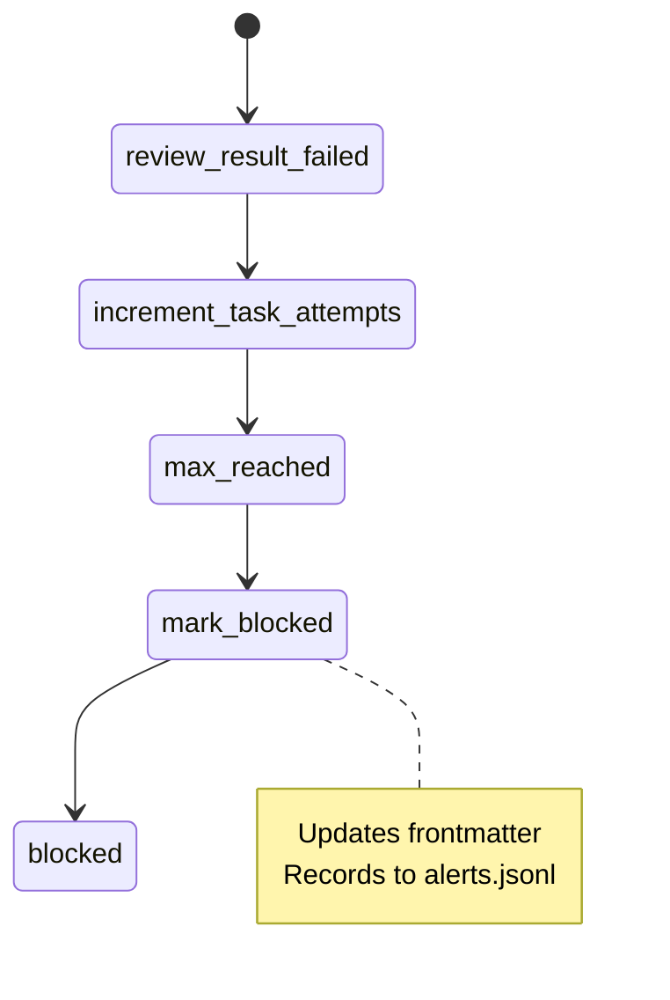

# Auto Block Flow Diagram

This diagram illustrates the auto-blocking flow in the workflow when task attempts reach maximum.

```mermaid
stateDiagram-v2
    [*] --> review_result_failed
    review_result_failed --> increment_task_attempts
    increment_task_attempts --> max_reached
    max_reached --> mark_blocked
    mark_blocked --> blocked
    note right of mark_blocked
        Updates frontmatter
        Records to alerts.jsonl
    end note
```