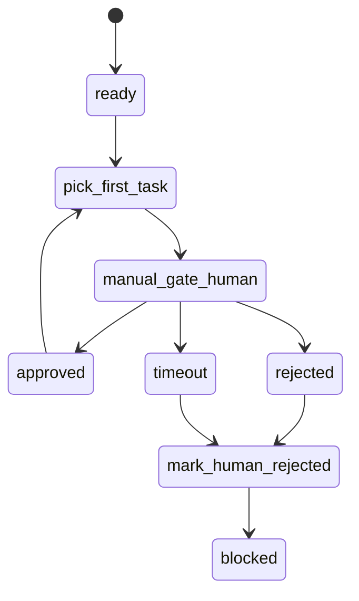

# Human Gate Flow Diagram

This diagram illustrates the flow of a human gate process in the workflow.

```mermaid
stateDiagram-v2
    [*] --> ready
    ready --> pick_first_task
    pick_first_task --> manual_gate_human
    manual_gate_human --> approved
    manual_gate_human --> rejected
    manual_gate_human --> timeout
    approved --> pick_first_task
    rejected --> mark_human_rejected
    timeout --> mark_human_rejected
    mark_human_rejected --> blocked
```