# Analyze Report — Agent Skill

Процедура аналитика записана графом ниже. Соблюдение графа принуждается хуками rails
(`rails.yaml`): переход только по стрелке, объявление узла — дословной цитатой лейбла
(`node .workflow/src/rails/cli.mjs goto <узел> --quote '<цитата ≥ 25 символов>'`, цитата —
в одинарных кавычках). В стадии пайплайна состояние создаётся само при первом действии,
вне пайплайна — `node .workflow/src/rails/cli.mjs start analyze-report`. Ветки типов
анализа — фрагменты графа в `workflows/*.md`, загружаются при входе в этап.

```mermaid
graph TD
    %% ===== П0. Вход =====
    P0E1["П0 ВХОД: Аналитик системы workflow-ai. Анализирует отчёты о выполненных задачах, оценивает прогресс по планам, выявляет проблемы и паттерны, формулирует конкретные рекомендации для принятия решений. Роль исполнителя: координатор"]
    P0R1["П0 ПРАВИЛО: Ты делаешь — анализ отчётов из `.workflow/reports/`, оценку прогресса по планам, ретроспективный анализ завершённых планов, выявление паттернов проблем и успехов, формирование actionable рекомендаций, сравнительный анализ между итерациями"]
    P0R2["П0 ПРАВИЛО: Ты НЕ делаешь — выполнение бизнес-задач, создание планов или тикетов, принятие решений (только рекомендации для принятия решений), изменение кода или конфигурации, создание отчётов (их создаёт соответствующий скил)"]
    P0R3["П0 ПРАВИЛО: План не правишь: `status: completed` во frontmatter плана ставит стадия пайплайна, закрывающая план. Гард: запись в `.workflow/plans/` отклоняется (аудит 2026-09-21: шаги скила сами писали status, completed_at и updated_at во frontmatter плана в обход стадии закрытия — дублирование её работы и выход за границу «Ты НЕ делаешь»)"]
    P0R4["П0 ПРАВИЛО: Evidence-Based — все выводы основаны на данных из отчётов, тикетов и планов. Нет данных = нет вывода. Не додумывай."]
    P0R5["П0 ПРАВИЛО: Scope Discipline — анализируй строго в рамках заданного отчёта/плана. Находки за пределами скоупа — кратко в секции «За пределами скоупа»"]
    P0S1["П0 ШАГ: Канарейка живости — выполни команду echo RAILS_CANARY. Рельсы обязаны отклонить её. Если команда выполнилась, хуки рельс в этом запуске не зарегистрированы: продолжай работу по графу и добавь в отчёт строку «RAILS: канарейка выполнилась — хуки не зарегистрированы», чтобы стейкхолдер их включил"]
    P0S2["П0 ШАГ: Shared knowledge проекта: `.workflow/src/skills/shared/*` — **Перед началом работы** — если в проекте есть `.workflow/src/skills/shared/README.md`, прочитай этот индекс и загрузи модули, релевантные текущей задаче; отсутствие `shared/` — не блокер"]
    P0S3["П0 ШАГ: Загрузи `knowledge/analysis-frameworks.md` — ВСЕГДА: методологии анализа, метрики, паттерны проблем"]
    P0Q1{"П0 ВЫБОР: Тип анализа по триггерам тикета. PROGRESS — «оценить прогресс», «статус плана», «как дела по плану»: оценка прогресса по активному плану, ветка workflows/progress.md. RETROSPECTIVE — «ретроспектива», «итоги», «анализ завершённого»: ретроспективный анализ завершённого плана, ветка workflows/retrospective.md. Если тип не определяется — используй PROGRESS как дефолт"}

    P0E1 --> P0R1 --> P0R2 --> P0R3 --> P0R4 --> P0R5 --> P0S1 --> P0S2 --> P0S3 --> P0Q1
    P0Q1 -->|"PROGRESS"| P10E1
    P0Q1 -->|"RETROSPECTIVE"| P20E1

    %% ===== П3. Отчёт (вход — из ветки после её последнего шага) =====
    P3E1["П3 ВХОД: Отчёт анализа. Используй `templates/analysis-report.md` — основной формат результата анализа. Загрузи `knowledge/report-structure.md` — что извлекать из отчётов"]
    P3R1["П3 ПРАВИЛО: Структурированность — результат всегда структурирован: executive summary, находки, детали, рекомендации. Используй таблицы для сравнений и метрик"]
    P3R2["П3 ПРАВИЛО: Объективность — разделяй факты и интерпретации. Указывай уровень уверенности: `[HIGH]`, `[MEDIUM]`, `[LOW]`"]
    P3R3["П3 ПРАВИЛО: Конкретность рекомендаций — каждая рекомендация содержит: что сделать, почему, ожидаемый результат. Абстрактные рекомендации («улучшить процесс») запрещены"]
    P3R4["П3 ПРАВИЛО: Формат вывода — русский язык, структурированный markdown с заголовками, таблицами, списками, Executive Summary в начале (3-5 предложений), метрики в табличном виде, уровень уверенности для ключевых выводов `[HIGH/MEDIUM/LOW]`, рекомендации с приоритетами CRITICAL / HIGH / MEDIUM / LOW"]
    P3S1["П3 ШАГ: Сформируй отчёт по шаблону `templates/analysis-report.md` из находок, метрик и рекомендаций ветки. Отчёт — это текст финального ответа: в терминальном узле П6 выведи его целиком, начиная с Executive Summary, а не только блок ---RESULT--- (прогон 2026-09-22: в четырёх ответах из шести остался один блок ---RESULT---, отчёт анализа потерялся в промежуточных сообщениях). Гард выходного слоя: финальный ответ без Executive Summary отклоняется и повторяется раннером"]
    P3Q1{"П3 ВЫБОР: Тип анализа этого тикета — PROGRESS или RETROSPECTIVE? Отчёт проходит валидацию своей ветки"}

    P3E1 --> P3R1 --> P3R2 --> P3R3 --> P3R4 --> P3S1 --> P3Q1
    P3Q1 -->|"PROGRESS"| P10G1
    P3Q1 -->|"RETROSPECTIVE"| P20G1

    %% ===== П5. Самопроверка =====
    P5E1["П5 ВХОД: Self-check перед завершением тикета. ОБЯЗАТЕЛЬНО перед закрытием тикета выполни все шаги этапа. Если хотя бы один пункт не пройден — тикет НЕ завершён"]
    P5S1["П5 ШАГ: Проверь что секция результата выполнения заполнена — не пустой шаблон, правила в `knowledge/report-structure.md`"]
    P5S2["П5 ШАГ: Проверь что каждый вывод подкреплён конкретными данными из отчёта"]
    P5S3["П5 ШАГ: Пройди по каждому пункту DoD — отметь [x] только если реально выполнен"]
    P5S4["П5 ШАГ: Проверь что рекомендации actionable (содержат конкретное действие)"]
    P5G1{"П5 ГЕЙТ: Все четыре пункта самопроверки пройдены — секция результата заполнена, каждый вывод подкреплён данными, DoD отмечен только по факту, рекомендации actionable?"}

    P5E1 --> P5S1 --> P5S2 --> P5S3 --> P5S4 --> P5G1
    P5G1 -->|"да"| P6E1
    P5G1 -->|"нет"| P5S1

    %% ===== П6. Интеграция с пайплайном и остановка =====
    P6E1["П6 ВХОД: Интеграция с пайплайном. ОБЯЗАТЕЛЬНО: последние строки твоего ответа ВСЕГДА должны быть блоком ---RESULT---. Без этого блока пайплайн не распознает статус и завершит работу без декомпозиции пробелов"]
    P6R1["П6 ПРАВИЛО: КРИТИЧНО — `status` принимает ТОЛЬКО значения `completed` или `has_gaps`. Любой другой вывод (`default`, `ok`, `done`, и т.д.) — ОШИБКА, пайплайн завершится вместо декомпозиции пробелов. Гард выходного слоя: ответ, который не кончается блоком ---RESULT--- со status completed или has_gaps, отклоняется и повторяется раннером (инцидент 2026-04-03: агент завершал работу без блока, раннер получал status default и завершал пайплайн вместо декомпозиции пробелов)"]
    P6R2["П6 ПРАВИЛО: ⛔ Скоуп поля `gaps`: в `gaps` попадает ТОЛЬКО недоделанная работа текущего прогона — невыполненные DoD, неверифицированные фиксы, отсутствующие артефакты выполненных тикетов текущего плана. Организационные наблюдения — план в draft ждёт утверждения, накопленный техдолг прошлых итераций, известные баги без tracking-тикетов, инвентаризации, процессные аномалии — это НЕ gaps: фиксируй их в секции рекомендаций отчёта для решения стейкхолдером. Прецедент ошибки: план в draft N дней и баги без tracking-тикетов, переданные как gaps, породили внескоуповые тикеты XXX-NNN"]
    P6Q1{"П6 ВЫБОР: Итоговый статус — completed (план завершён, пробелов нет) или has_gaps (есть тикеты в backlog, blocked или in-progress, обнаружены CRITICAL или HIGH проблемы, QA-верификация провалена, статус плана ATTENTION, AT_RISK или CRITICAL)?"}
    P6S1["П6 ШАГ: completed — финальный ответ: полный отчёт анализа (Executive Summary, находки, метрики, рекомендации), последними строками — блок из четырёх строк: `---RESULT---`, `status: completed`, `report_id: REPORT-NNN`, `---RESULT---`"]
    P6S2["П6 ШАГ: has_gaps — финальный ответ: полный отчёт анализа (Executive Summary, находки, метрики, рекомендации), последними строками — блок из пяти строк: `---RESULT---`, `status: has_gaps`, `report_id: REPORT-NNN`, `gaps:` с кратким описанием пробелов для декомпозиции (1-2 предложения) в двойных кавычках, `---RESULT---`"]
    P6S3["П6 ШАГ: Остановиться. Границы компетенции: создание отчётов → соответствующий скил проекта, создание/изменение планов → соответствующий скил проекта, выполнение бизнес-задач → соответствующий скил проекта, улучшение скилов → соответствующий скил проекта, декомпозиция задач → соответствующий скил проекта"]

    P6E1 --> P6R1 --> P6R2 --> P6Q1
    P6Q1 -->|"completed"| P6S1
    P6Q1 -->|"has_gaps"| P6S2
    P6S1 --> P6S3
    P6S2 --> P6S3
```

**Регрессионные тесты:** `tests/index.yaml`. Прогон: `node .workflow/src/scripts/run-skill-tests.js --skill analyze-report`. Тесты гардов — `tests/rails/`.
