# Воркфлоу: PROGRESS — Оценка прогресса по плану

Фрагмент графа аналитика, этап П10. Вход — из П0 по ветке PROGRESS; после последнего шага — отчёт ядра (П3), затем валидация ветки (П10G1) и самопроверка ядра (П5).

```mermaid
graph TD
    P10E1["П10 ВХОД: PROGRESS — оценка прогресса по плану. Оценка текущего состояния активного плана: что выполнено, что в работе, что отстаёт, какие риски"]
    P10R1["П10 ПРАВИЛО: Верификация каждой проблемы по логу пайплайна — ОБЯЗАТЕЛЬНО. ⛔ Без этого шага findings не имеют доказательной базы и относятся к категории «угаданных». Принцип evidence-based нарушается, отчёт превращается в гадание. Зачем: отчёт-источник (REPORT-NNN) уже содержит проблемы, но возможно, с неверной атрибуцией — скил, генерирующий отчёты, может скопировать root cause без проверки лога. Твоя задача как аналитика — независимо верифицировать каждую проблему по логу, а не доверять формулировкам отчёта на слово"]
    P10R2["П10 ПРАВИЛО: ⛔ Запрет угадывания. Если ты не нашёл в логе строку с решением — никогда не пиши «вероятно, это компонент X». Вместо этого напиши `evidence not found, confidence LOW`. Угаданные обвинения уводят коуча в неправильную сторону и заставляют править не те компоненты"]
    P10S1["П10 ШАГ: Собери входные данные. Из тикета извлеки: какой план анализировать (путь к файлу плана), какой отчёт является источником данных (путь к файлу отчёта), контекст: зачем нужен анализ, какие решения будут приниматься"]
    P10S2["П10 ШАГ: Прочитай файл плана из `.workflow/plans/`, файл отчёта из `.workflow/reports/`, тикеты из `.workflow/tickets/done/` и `.workflow/tickets/archive/` (завершённые), из `.workflow/tickets/in-progress/` (текущие), из `.workflow/tickets/ready/` (ожидающие), из `.workflow/tickets/blocked/` (заблокированные)"]
    P10S3["П10 ШАГ: Рассчитай метрики прогресса — загрузи `algorithms/progress-assessment.md` и `knowledge/analysis-frameworks.md`. Основной путь — скрипт: node .workflow/src/skills/analyze-report/scripts/calc-plan-metrics.js PLAN-NNN, где PLAN-NNN — ID плана из тикета. Прочитай JSON из блока ---RESULT---: distribution — распределение тикетов по статусам (done, in-progress, ready, blocked, backlog, archive), completion_pct — процент выполнения, avg_time_to_done — среднее время выполнения тикета (дни), blocked_rate — процент заблокированных тикетов, rework_count — количество тикетов с повторной работой, total_tickets — общее количество тикетов плана. Скрипт не считает Weighted Completion и First-Pass Rate — досчитай их вручную по шагам 2-3 `algorithms/progress-assessment.md`. Используй эти метрики как основу для дальнейшего анализа"]
    P10S4["П10 ШАГ: Ручной расчёт (fallback) — если скрипт недоступен или вернул ошибку, собери данные вручную: общее количество задач в плане, количество завершённых, в работе, ожидающих, заблокированных, процент выполнения по количеству и по сложности"]
    P10S5["П10 ШАГ: Качество выполнения — загрузи `knowledge/report-structure.md`. Для каждого завершённого тикета: выполнены ли все критерии DoD, были ли ревью-замечания, были ли повторные выполнения"]
    P10S6["П10 ШАГ: Выяви проблемы и риски — блокеры (заблокированные тикеты, зависимости), отклонения (задачи с замечаниями на ревью), пробелы (задачи плана, не покрытые тикетами), паттерны (повторяющиеся проблемы в тикетах)"]
    P10S7["П10 ШАГ: Найди лог сессии, в которой возникла проблема. В `.workflow/logs/` найди файлы `pipeline_*.log` за период анализируемого отчёта (по mtime или по диапазону дат из отчёта). Для каждой проблемы из шага выявления: найди в логе строки с упоминанием проблемного тикета (Grep по `ticket_id`), извлеки имя стейджа, который принял решение, и его обоснование (поле `reason` в `---RESULT---`), сравни найденную атрибуцию с тем, что написано в отчёте"]
    P10S8["П10 ШАГ: Классифицируй каждую проблему по логу. Если атрибуция в отчёте совпадает с логом — finding имеет уверенность HIGH, в отчёт цитата лога: `pipeline_*.log:NNNN`. Если атрибуция в отчёте НЕ совпадает с логом (отчёт обвиняет компонент X, а лог показывает компонент Y) — это отдельный finding уровня CRITICAL: запиши в раздел проблем «Отчёт REPORT-NNN неверно атрибутировал root cause проблемы Z: указан компонент X, фактически решение принял компонент Y (лог: pipeline_*.log:NNNN)», это сигнал о дефекте в скиле, генерирующем отчёты — рекомендуй создание тикета на правку соответствующего скила. Если в логе нет данных по тикету (например, инцидент произошёл до начала логирования) — finding получает уверенность LOW, в отчёте честно указать: «evidence отсутствует, требуется ручное расследование»"]
    P10S9["П10 ШАГ: Сформулируй рекомендации. Для каждой проблемы или риска: Что: конкретное действие. Почему: причина (на основе данных) + цитата строки лога как evidence (для findings с уверенностью HIGH). Приоритет: CRITICAL / HIGH / MEDIUM / LOW. Уверенность: HIGH (есть evidence из лога) / MEDIUM (есть данные из тикетов, но нет лога) / LOW (только косвенные признаки)"]
    P10S10["П10 ШАГ: Верификация gaps перед передачей в пайплайн — ОБЯЗАТЕЛЬНО. ⛔ Без этого шага следующая стадия пайплайна (декомпозиция пробелов) получит дублирующие или уже решённые gaps. Перед формированием ---RESULT--- со status: has_gaps, для каждого артефакта, упомянутого в рекомендациях как «нужно создать» (тикет, файл, баг-репорт): Glob по `.workflow/tickets/` на ID артефакта (например, `**/XXX-NNN.md`). Если файл уже существует — это не gap. Исключи из описания gaps. В секции рекомендаций отметь: «Тикет ID уже существует на диске, создание не требуется». Если файл не существует — это валидный gap, включи в описание. Зачем: предшествующие стадии исполнения могут создавать тикеты в нарушение своих ограничений. Передача «создать тикет X» в gaps при уже существующем X приводит к дублированию или перезаписи на стадии декомпозиции пробелов"]
    P10S11["П10 ШАГ: Определи статус плана — возьми статус из шага 5 алгоритма `progress-assessment.md` (по Completion, Block Rate, First-Pass Rate): 🟢 ON_TRACK / 🟡 ATTENTION / 🟠 AT_RISK / 🔴 CRITICAL. ⚠️ Важно: этот статус — визуальная оценка прогресса, это не то же самое, что завершённость плана (следующий шаг)"]
    P10S12["П10 ШАГ: Критерий завершённости плана. План считается `completed` только когда выполнены оба условия одновременно: 1) 100% тикетов плана — в `done/` или `archive/`, 2) анализ не выявил пробелов (`has_gaps: false`). Если оба условия выполнены — итоговый статус completed, если хотя бы одно не выполнено — has_gaps. Обновление `status: completed` во frontmatter плана и архивирование тикетов выполняет стадия `complete-plan` (`complete-plan.js`) — analyze-report frontmatter плана не редактирует"]
    P10G1{"П10 ГЕЙТ: Валидация PROGRESS. Все метрики рассчитаны на основе реальных данных, каждая проблема подкреплена конкретным примером, каждый finding с уверенностью HIGH имеет цитату из лога (`pipeline_*.log:NNNN`), каждый finding без evidence помечен как LOW, без угадывания виновника, расхождения с атрибуцией в отчёте-источнике вынесены в отдельный finding CRITICAL, рекомендации actionable (содержат конкретное действие), executive summary отражает ключевые находки, статус плана соответствует метрикам? STOP-GATE: перед тем как вернуть `status: completed`, перепроверь оба условия критерия завершённости (100% тикетов в `done`/`archive`, `has_gaps: false`). Если хотя бы одно не выполнено — верни `status: has_gaps`, а не `completed`"}

    P10E1 --> P10R1 --> P10R2 --> P10S1 --> P10S2 --> P10S3 --> P10S4 --> P10S5 --> P10S6 --> P10S7 --> P10S8 --> P10S9 --> P10S10 --> P10S11 --> P10S12 --> P3E1
    P10G1 -->|"да"| P5E1
    P10G1 -->|"нет"| P10S3
```

