# Воркфлоу: RETROSPECTIVE — Ретроспективный анализ завершённого плана

Фрагмент графа аналитика, этап П20. Вход — из П0 по ветке RETROSPECTIVE; после последнего шага — отчёт ядра (П3), затем валидация ветки (П20G1) и самопроверка ядра (П5).

```mermaid
graph TD
    P20E1["П20 ВХОД: RETROSPECTIVE — ретроспективный анализ завершённого плана. Полный анализ: что получилось, что нет, какие уроки извлечь, что улучшить в следующем цикле"]
    P20R1["П20 ПРАВИЛО: Верификация паттернов проблем по логам пайплайна — ОБЯЗАТЕЛЬНО. ⛔ Без этого шага ретроспектива воспроизводит ошибки атрибуции из отчётов-источников. Принцип evidence-based нарушается. Зачем: ретроспектива опирается на REPORT-NNN, которые могут содержать угаданную атрибуцию root cause (если их сгенерировала старая версия скила, генерирующего отчёты, без проверки лога). Чтобы Lessons Learned были полезными, их причинно-следственная часть должна опираться на лог, а не на пересказ отчёта"]
    P20R2["П20 ПРАВИЛО: ⛔ Запрет угадывания. Если evidence нет — пиши уровень уверенности LOW. Не интерпретируй знакомые имена компонентов как «вероятную причину»"]
    P20S1["П20 ШАГ: Pre-condition: проверка статуса плана. До начала сбора данных — прочитай frontmatter плана. Если `status` не `completed` и не `archived` — зафиксировать как находку в разделе Lessons Learned отчёта: «Аномалия процесса: план не имел статуса `completed` к моменту запуска ретроспективы — тикеты плана не все в `done`/`archive`, либо стадия `complete-plan` ещё не отработала», и продолжить сбор данных, ориентируясь на фактическое состояние тикетов. Если `status` уже `completed` или `archived` — пропустить (идемпотентность), продолжить в штатном режиме. ⚠️ `status: completed` во frontmatter плана устанавливает только стадия `complete-plan` (`complete-plan.js`) пайплайна. Ретроспектива и progress-анализ frontmatter плана не редактируют"]
    P20S2["П20 ШАГ: Собери входные данные. Из тикета извлеки: какой план анализировать, все связанные отчёты, контекст: для чего проводится ретроспектива. Прочитай файл плана из `.workflow/plans/`, все отчёты, связанные с планом, из `.workflow/reports/`, все тикеты плана из `.workflow/tickets/done/` и `.workflow/tickets/archive/` (для завершённого плана `complete-plan` переносит done-тикеты в archive), заблокированные тикеты (если остались) из `.workflow/tickets/blocked/`"]
    P20S3["П20 ШАГ: Оцени результат vs цели — загрузи `knowledge/analysis-frameworks.md`. Для каждой цели плана — таблицей: цель, статус (✅, ⚠️ или ❌), результат (что получилось), отклонение (чем отличается от ожиданий)"]
    P20S4["П20 ШАГ: Проанализируй эффективность процесса — загрузи `algorithms/progress-assessment.md`. Основной путь — скрипт: node .workflow/src/skills/analyze-report/scripts/calc-plan-metrics.js PLAN-NNN, где PLAN-NNN — ID анализируемого плана. Прочитай JSON из блока ---RESULT---: скрипт возвращает completion_pct, blocked_rate, rework_count, avg_time_to_done, distribution. Используй готовые метрики для Throughput: `completion_pct` + `distribution` (завершено / всего), Blockers: `blocked_rate` + `distribution.blocked`, Rework: `rework_count`. Скрипт не считает Weighted Completion и First-Pass Rate — досчитай их вручную по шагам 2-3 `algorithms/progress-assessment.md`"]
    P20S5["П20 ШАГ: Fallback, если скрипт недоступен — собери все метрики вручную. Throughput: сколько тикетов завершено / сколько было в плане. Quality: First-Pass Rate — формула в `algorithms/progress-assessment.md`. Blockers: количество и длительность блокировок. Rework: количество тикетов, потребовавших повторного выполнения"]
    P20S6["П20 ШАГ: Выяви паттерны. Что работало хорошо (Keep): практики, которые привели к успешным результатам, процессы, которые работали гладко. Что не работало (Stop): практики, которые приводили к проблемам, повторяющиеся ошибки. Что попробовать (Try): идеи для улучшения на основе выявленных проблем"]
    P20S7["П20 ШАГ: Верифицируй паттерны проблем по логам пайплайна. Алгоритм: найди логи сессий в `.workflow/logs/`, относящиеся к периоду плана. Может быть несколько `pipeline_*.log` за разные дни. Для каждой проблемы в категории «Stop»: найди в логах строки с упоминанием тикета или паттерна (Grep по `ticket_id` или ключевому слову), извлеки точное имя стейджа, который принял проблемное решение, и его обоснование (поле `reason`), сравни с тем, что написано в отчёте-источнике. Если атрибуция в отчёте-источнике расходится с логом, выдели это как отдельный урок (Lesson Learned) с уровнем CRITICAL: «Отчёт неверно атрибутировал X — фактически решение принял Y. Это указывает на дефект в скиле, генерирующем отчёты». Рекомендуй создание тикета на правку. Каждый паттерн «Stop» должен иметь evidence: цитата строки лога или явная пометка `evidence not found, confidence LOW`"]
    P20S8["П20 ШАГ: Извлеки уроки (Lessons Learned). Для каждого урока — Наблюдение: что произошло (факт). Причина: почему это произошло (анализ) — для уровня HIGH обязательна цитата строки лога. Урок: что из этого следует (вывод). Действие: что изменить в следующем цикле (рекомендация). Уверенность: HIGH (есть evidence из лога) / MEDIUM (только данные из тикетов) / LOW (косвенные признаки)"]
    P20S9["П20 ШАГ: Сформулируй рекомендации для следующего плана — что учесть при планировании, какие риски закладывать, какие процессы изменить, приоритеты CRITICAL / HIGH / MEDIUM / LOW"]
    P20G1{"П20 ГЕЙТ: Валидация RETROSPECTIVE. Каждая цель плана покрыта анализом (результат vs ожидания), метрики процесса рассчитаны на реальных данных, паттерны подкреплены конкретными примерами из тикетов, каждый паттерн «Stop» имеет evidence из лога (`pipeline_*.log:NNNN`) или явную пометку LOW, расхождения с атрибуцией в отчёте-источнике вынесены в отдельный урок CRITICAL, уроки содержат и наблюдение, и причину, и действие, уроки помечены уровнем уверенности (HIGH/MEDIUM/LOW), рекомендации actionable и приоритизированы, executive summary отражает ключевые выводы?"}

    P20E1 --> P20R1 --> P20R2 --> P20S1 --> P20S2 --> P20S3 --> P20S4 --> P20S5 --> P20S6 --> P20S7 --> P20S8 --> P20S9 --> P3E1
    P20G1 -->|"да"| P5E1
    P20G1 -->|"нет"| P20S3
```

