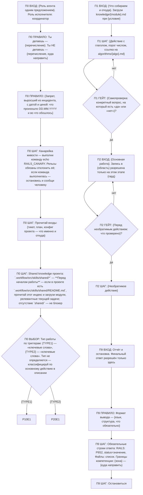
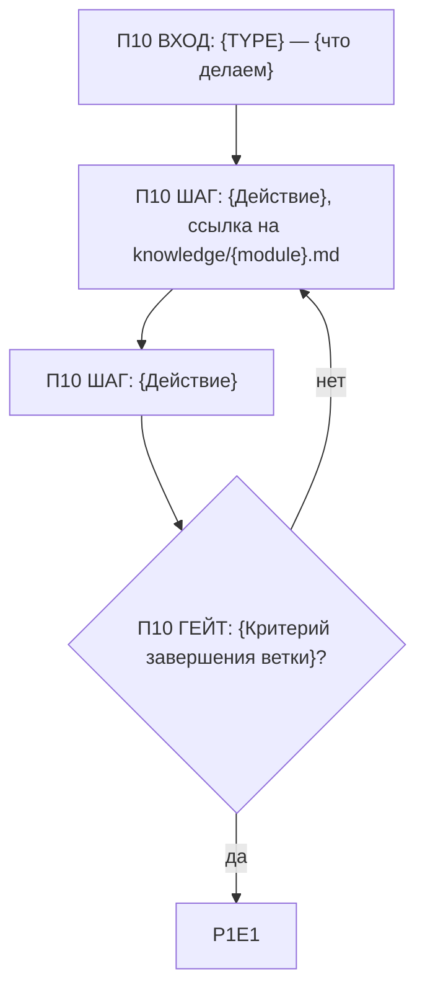

# Шаблон: Структура нового скила (на рельсах)

## SKILL.md

````markdown
---
name: {skill-name}
description: >
  {2-3 предложения: кто агент, что делает, в каком контексте}
ticket_prefix: {PREFIX}
rails: rails.yaml
---

# {Skill Name} — Agent Skill

Процедура записана графом ниже; соблюдение принуждается хуками rails (`rails.yaml`):
старт — `node .workflow/src/rails/cli.mjs start {skill-name}`, переход только по стрелке,
объявление узла — цитатой лейбла
(`node .workflow/src/rails/cli.mjs goto <узел> --quote "<цитата ≥ 25 символов>"`).
Ветки типов работы — фрагменты в `workflows/*.md`. Грамматика и принципы — концепция
«Рельсы для агента» (в коуче: `knowledge/rails-concept.md`).


````

## Фрагмент `workflows/{type}.md`

````markdown
# Воркфлоу: {TYPE} — {Название}

Фрагмент графа, этап П10. Вход — из П0 по ветке {TYPE}; выход — в П1.


````

## `rails.yaml`

```yaml
version: 1
skill: {skill-name}
entry: P0E1
terminal: [P9S2]
pause_nodes: []                    # узлы вопроса стейкхолдеру
fragments: ["workflows/*.md"]
quote_min: 25
canary: "echo RAILS_CANARY"

write_scope:                       # только то, что скил реально пишет
  - "{область записи}/**"
allow_temp: true
write_deny:
  - ".workflow/src/skills/{skill-name}/rails.yaml"
  - ".workflow/src/skills/{skill-name}/tests/rails/**"
  - ".workflow/src/rails/**"

deny_shell: []                     # только по инциденту: pattern, reason, incident (дата)
deny_mcp: []

stage_actions:
  write_result:
    kind: [edit, write]
    match: "{область записи}/**"
    stages: [2]

cycles:
  - { from: 1, to: 1, max: 3, reason: "Гейт П1 не проходит трижды — выход к человеку" }
  - { from: 2, to: 2, max: 3, reason: "Гейт П2 не проходит трижды — выход к человеку" }
  - { from: 10, to: 10, max: 3, reason: "Ветка {TYPE} не сходится трижды — выход к человеку" }

output:
  final_requires:
    - "RAILS:\\s*P\\d+[ERSGQ]\\d+"
    - "status\\s*="
    - "Файлы:"
  max_stop_blocks: 2
```

## Тест гарда `tests/rails/{guard}.test.mjs`

```js
import { test } from 'node:test';
import assert from 'node:assert/strict';
import { decide } from '../../../../rails/core.mjs';

// Синтетический вход: cwd — временный проект с этим скилом, состояние в узле этапа 2.
test('{guard}: отказ там, где ждём отказ', async () => {
  const r = await decide({ action: { tool: 'Bash', kind: 'shell', command: '{запрещённая команда}' }, ctx: { cwd: '{tmp}', sessionId: 's1', role: 'coordinator' } });
  assert.equal(r.decision, 'deny');
});
test('{guard}: молчание там, где ждём молчание', async () => { /* разрешённая команда → allow */ });
test('{guard}: молчание для делегата', async () => { /* role: executor → allow */ });
```

## Knowledge файл

```markdown
# {Модуль знаний}

## {Категория}
| Параметр | Значение | Описание |
|----------|----------|----------|
<!-- РАСШИРЕНИЕ: добавляй {что} ниже -->
```

## Algorithm файл

```markdown
# Алгоритм: {Название}
## Вход
{Входные данные}
## Алгоритм
### 1. {Шаг}
## Выход
{Результат}
## Пример
{Конкретный пример}
```
