# Воркфлоу: ANALYZE — Анализ эффективности скила

Фрагмент графа коуча, этап П30. Вход — из П0 по ветке ANALYZE; выход — в П1 (evidence и root cause по ключевому finding), далее правка, тест и бэклог.

```mermaid
graph TD
    P30E1["П30 ВХОД: ANALYZE — анализ работы скила на основе завершённых планов, тикетов, отчётов, логов пайплайна и журнала отказов rails. Тикеты из analyzed_tickets (прочитаны в П0) исключены из выборки"]
    P30S1["П30 ШАГ: Сбор данных — завершённые тикеты из .workflow/tickets/done/ (результаты, время, качество), планы из .workflow/plans/ (цели, декомпозиция, отклонения), отчёты из .workflow/reports/ (метрики, выводы, проблемы), журнал отказов .workflow/logs/rails-denials.jsonl и логи пайплайна за период. Фильтруй по ticket_prefix скила. Исключи тикеты, уже присутствующие в analyzed_tickets"]
    P30S2["П30 ШАГ: Паттерны успеха — какие типы тикетов выполняются хорошо, какие ветки дают стабильный качественный результат, какие knowledge-модули используются чаще всего. Паттерны проблем — какие тикеты завершаются с неполным результатом, где агент отклоняется от графа, какие знания отсутствуют и требуют дополнения, где агент «додумывает» вместо использования knowledge"]
    P30S3["П30 ШАГ: Проверка соответствия процесса — ОБЯЗАТЕЛЬНО для каждого тикета сверь предписанные графом узлы, инструменты и шаги (из SKILL.md скила) с фактически использованными (из «Agent used», «Что сделано», лога пайплайна). Расхождение = finding, даже если DoD формально passed"]
    P30S4["П30 ШАГ: Соответствие рельсам поведенчески — node .workflow/src/rails/cli.mjs report --days N --skill имя-скила (журнал проекта) и report --journal .workflow/src/skills/имя-скила/tests/cases/TC-ID/current (журналы прогонов тестов, сохранённые раннером как rails-trial-N.jsonl), затем algorithms/rails-compliance.md (поведенческие метрики): отказы по узлу, узлы с 3 и более повторами в одной сессии, срабатывания потолков, сбросы состояния, отказы выходного слоя, переходы без маркера. Повторяющийся отказ на одном узле — дефект формулировки узла: finding с рекомендацией переформулировать узел, а не ужесточить текст"]
    P30S5["П30 ШАГ: Gap-анализ — примени algorithms/gap-analysis.md: типы задач, которые приходят, но не имеют ветки графа, знания, которые нужны, но отсутствуют в knowledge, решения, которые принимаются ad-hoc вместо формализованного алгоритма"]
    P30S6["П30 ШАГ: Метрики качества — полнота результата (% тикетов с заполненными всеми секциями DoD), соответствие графу (% тикетов, где агент прошёл предписанные узлы), использование knowledge (частота обращений к модулям), время выполнения (среднее по типам тикетов), балл соответствия рельсам"]
    P30S7["П30 ШАГ: Выводы — топ-3 сильные стороны скила, топ-3 проблемы и узкие места, топ-3 возможности для улучшения, конкретные рекомендации с указанием файлов и узлов для изменения — оформи как часть отчёта по templates/audit-report.md. Ключевой finding — в разбор evidence и root cause (П1, П2), правку (П3–П5) и бэклог (П6)"]

    P30E1 --> P30S1 --> P30S2 --> P30S3 --> P30S4 --> P30S5 --> P30S6 --> P30S7 --> P1E1
```

