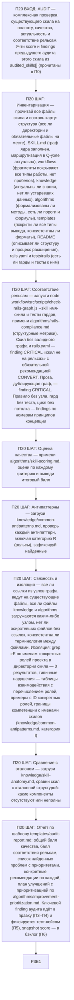

# Воркфлоу: AUDIT — Полный аудит скила

Фрагмент графа коуча, этап П20. Вход — из П0 по ветке AUDIT; выход — в П3 (черновик правки по ключевому finding).

```mermaid
graph TD
    P20E1["П20 ВХОД: AUDIT — комплексная проверка существующего скила на полноту, качество, актуальность и соответствие рельсам. Учти score и findings предыдущего аудита этого скила из audited_skills[] (прочитаны в П0)"]
    P20S1["П20 ШАГ: Инвентаризация — прочитай все файлы скила и составь карту: структура (все ли директории и обязательные файлы на месте), SKILL.md (граф ядра заполнен, маршрутизация в Q-узле актуальна), workflows (фрагменты покрывают все типы работы, нет пробелов), knowledge (актуальны ли знания, нет ли устаревших данных), algorithms (формализованы ли методы, есть ли пороги и формулы), templates (покрыты ли все типы вывода, консистентны ли форматы), README (описывает ли структуру и процесс расширения), rails.yaml и tests/rails (есть ли гарды и тесты к ним)"]
    P20S2["П20 ШАГ: Соответствие рельсам — запусти node .workflow/src/scripts/check-rails-graph.js --skill имя-скила и тесты гардов, примени algorithms/rails-compliance.md (структурные метрики). Скил без валидного графа и rails.yaml — finding CRITICAL «скил не на рельсах» с обязательной рекомендацией CONVERT. Проза, дублирующая граф, — finding CRITICAL. Правило без узла, гард без теста, цикл без потолка — findings по номерам принципов концепции"]
    P20S3["П20 ШАГ: Оценка качества — примени algorithms/skill-scoring.md, оцени по каждому критерию и выведи итоговый балл"]
    P20S4["П20 ШАГ: Антипаттерны — загрузи knowledge/common-antipatterns.md, проверь каждый антипаттерн, включая категорию R (рельсы), зафиксируй найденные"]
    P20S5["П20 ШАГ: Связность и изоляция — все ли ссылки из узлов графа ведут на существующие файлы, все ли файлы knowledge и algorithms загружаются каким-либо узлом, нет ли осиротевших файлов без ссылок, консистентна ли терминология между файлами. Изоляция: grep -rE по именам конкретных ролей проекта в директории скила — 0 результатов, типичные нарушения — таблицы взаимодействия с перечислением ролей, примеры с ID конкретных ролей, границы компетенции с именами скилов (knowledge/common-antipatterns.md, категория I)"]
    P20S6["П20 ШАГ: Сравнение с эталоном — загрузи knowledge/skill-anatomy.md, сравни скил с эталонной структурой: какие компоненты отсутствуют или неполны"]
    P20S7["П20 ШАГ: Отчёт по шаблону templates/audit-report.md: общий балл качества, балл соответствия рельсам, список найденных проблем с приоритетами, конкретные рекомендации по каждой, план улучшений с приоритизацией по algorithms/improvement-prioritization.md. Ключевой finding аудита идёт в правку (П3–П4) и фиксируется тест-кейсом (П5), snapshot score — в бэклог (П6)"]

    P20E1 --> P20S1 --> P20S2 --> P20S3 --> P20S4 --> P20S5 --> P20S6 --> P20S7 --> P3E1
```
