# Воркфлоу: CONVERT — Перевод скила на рельсы

Фрагмент графа коуча, этап П70. Вход — из П0 по ветке CONVERT; выход — в П5 (тесты сконвертированного скила). Запись файлов разрешена на этом этапе (гард H3). Процедура — `algorithms/graph-conversion.md`.

```mermaid
graph TD
    P70E1["П70 ВХОД: CONVERT — перевод скила на рельсы: проза SKILL.md и воркфлоу становятся графом с цитируемыми узлами, гарды — записями rails.yaml с тестами. Загрузи knowledge/rails-concept.md и algorithms/graph-conversion.md. Ничего из содержимого скила не утрачивается — каждая фраза-инвариант получает узел, справочник или обоснованный отказ"]
    P70S1["П70 ШАГ: Инвентаризация исходного скила — wc -l всех файлов, список воркфлоу, knowledge, algorithms, templates, L0-anchors и L2-рубрики тестов скила (tests/cases, tests/rubrics), фразы-инварианты: node .workflow/src/scripts/check-rails-coverage.js --skill имя-скила --baseline HEAD печатает список"]
    P70S2["П70 ШАГ: Матрица переноса — для каждой фразы-инварианта: узел графа (ядро или фрагмент), справочник (knowledge, algorithms, templates) или обоснованный отказ. Карта — rails-migration.yaml в директории скила. Правило деления — по цитируемости, не по размеру: что агент обязан цитировать — в граф, что читается по надобности — в справочник"]
    P70S3["П70 ШАГ: Раздача этапов — ядро П0–П9 по существу скила (вход и правила, сбор данных, работа, самопроверка, отчёт), ветки типов работы П10, П20 и далее — по одному фрагменту на воркфлоу. Порядок внутри этапа: E, R, S, G или Q. Гейт перед каждым необратимым действием (критерий человека: необратимо или дорого откатить — пуш, удаление, установка зависимостей, всё видимое снаружи). Потолок у каждого цикла"]
    P70S4["П70 ШАГ: Гарды — только по инцидентам из coach-backlog.yaml, tests/cases/*.origin.incidents и git log скила, каждый с датой и ценой в лейбле узла, никаких гардов «на всякий случай». Запиши в rails.yaml: write_scope, deny_shell, deny_mcp, stage_actions, cycles, output. На каждый гард — тест в tests/rails/"]
    P70S5["П70 ШАГ: Запись файлов скила — SKILL.md (frontmatter с rails: rails.yaml, граф ядра), фрагменты workflows/*.md, rails.yaml, tests/rails/, rails-migration.yaml. Перед записью каждого файла — чеклист универсальности (П3S1) и изоляция"]
    P70G1{"П70 ГЕЙТ: check-rails-graph.js --skill зелёный, check-rails-coverage.js --skill --baseline --map без пропусков, все прежние L0-anchors и L2-рубрики скила зелёные или перепривязаны в той же правке, ядро не больше 400 строк, ядро с любым фрагментом и его справочниками не больше 800?"}

    P70E1 --> P70S1 --> P70S2 --> P70S3 --> P70S4 --> P70S5 --> P70G1
    P70G1 -->|"да"| P5E1
    P70G1 -->|"нет"| P70S2
```

