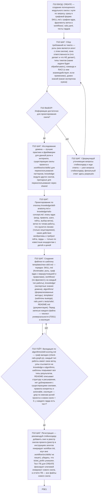

# Воркфлоу: CREATE — Создание нового скила

Фрагмент графа коуча, этап П10. Вход — из П0 по ветке CREATE; выход — в П5 (тест нового скила). Запись файлов разрешена на этом этапе (гард H3).

```mermaid
graph TD
    P10E1["П10 ВХОД: CREATE — создание полноценного модульного скила с нуля по запросу, сразу в графовой форме: SKILL.md с графом ядра, фрагменты веток в workflows/, rails.yaml, тесты гардов"]
    P10S1["П10 ШАГ: Сбор требований из тикета — роль (кем является агент с этим скилом), зона ответственности (что делает и что НЕ делает), типы тикетов (какие задачи будет обрабатывать), команда и RACI (с кем взаимодействует, если применимо), домен знаний (какая экспертиза нужна)"]
    P10Q1{"П10 ВЫБОР: Информации достаточно для проектирования скила?"}
    P10S2["П10 ШАГ: Сформулируй уточняющие вопросы стейкхолдеру и жди ответа — узел вопроса стейкхолдеру, финальный ответ здесь разрешён"]
    P10S3["П10 ШАГ: Исследование домена — лучшие практики и фреймворки для данной роли в интернете, существующие скилы проекта в .workflow/src/skills/ для переиспользования паттернов, knowledge-модули других скилов, пригодные для переиспользования через shared"]
    P10S4["П10 ШАГ: Проектирование по эталону knowledge/skill-anatomy.md и knowledge/rails-concept.md: этапы ядра (вход, правила, шаги, гейты, выбор веток), ветки по типам работы, что грузится лениво (только нецитируемое), какие действия необратимы и требуют гейта, гарды — только по известным инцидентам с датой и ценой"]
    P10S5["П10 ШАГ: Создание файлов по шаблону templates/new-skill.md — порядок: SKILL.md (frontmatter, роль, граф ядра с маршрутизацией и правилами), workflows/ (по фрагменту на каждый тип работы), knowledge/ (экспертные знания домена), algorithms/ (формализованные методы), templates/ (шаблоны вывода), rails.yaml с tests/rails/, README.md (документация). Перед записью каждого файла — чеклист универсальности (П3S1) и изоляция"]
    P10G1{"П10 ГЕЙТ: Валидация по algorithms/skill-scoring.md — граф валиден (check-rails-graph.js), каждый тип работы имеет свою ветку, узлы ссылаются на knowledge и algorithms, шаблоны покрывают все типы результатов, README описывает структуру и расширение, нет дублирования с существующими скилами, правила конкретны и actionable, изоляция — grep по именам ролей проекта в новом скиле = 0, у каждого гарда есть тест?"}
    P10S6["П10 ШАГ: Регистрация — рекомендуй стейкхолдеру добавить скил в реестр скилов проекта (реестр в инструкциях агентов генерирует workflow init, коуч вне .workflow/src/skills/ не пишет), убедись, что ticket_prefix уникален. Тест П5 для CREATE фиксирует ключевой инвариант нового скила, в отчёте П8 — все файлы нового скила"]

    P10E1 --> P10S1 --> P10Q1
    P10Q1 -->|"да"| P10S3
    P10Q1 -->|"нет"| P10S2
    P10S2 --> P10S1
    P10S3 --> P10S4 --> P10S5 --> P10G1
    P10G1 -->|"да"| P10S6
    P10G1 -->|"нет"| P10S5
    P10S6 --> P5E1
```
