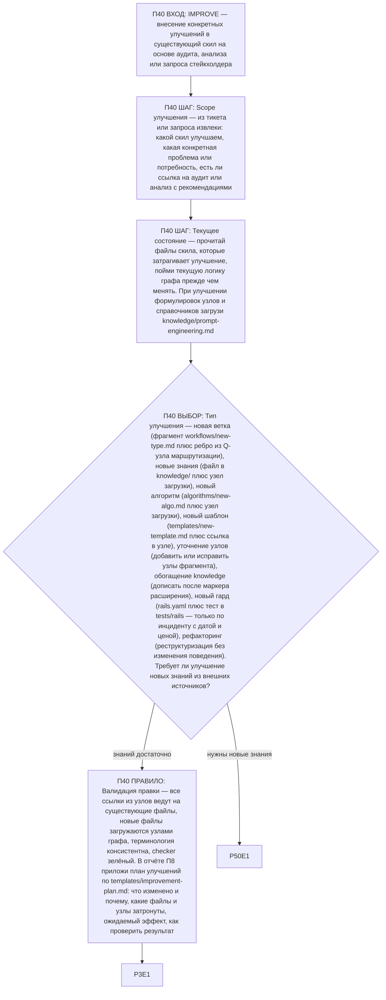

# Воркфлоу: IMPROVE — Точечное улучшение скила

Фрагмент графа коуча, этап П40. Вход — из П0 по ветке IMPROVE; выход — в П3 (черновик правки) или в П50 (если нужны новые знания).

```mermaid
graph TD
    P40E1["П40 ВХОД: IMPROVE — внесение конкретных улучшений в существующий скил на основе аудита, анализа или запроса стейкхолдера"]
    P40R1["П40 ПРАВИЛО: Валидация правки — все ссылки из узлов ведут на существующие файлы, новые файлы загружаются узлами графа, терминология консистентна, checker зелёный. В отчёте П8 приложи план улучшений по templates/improvement-plan.md: что изменено и почему, какие файлы и узлы затронуты, ожидаемый эффект, как проверить результат"]
    P40S1["П40 ШАГ: Scope улучшения — из тикета или запроса извлеки: какой скил улучшаем, какая конкретная проблема или потребность, есть ли ссылка на аудит или анализ с рекомендациями"]
    P40S2["П40 ШАГ: Текущее состояние — прочитай файлы скила, которые затрагивает улучшение, пойми текущую логику графа прежде чем менять. При улучшении формулировок узлов и справочников загрузи knowledge/prompt-engineering.md"]
    P40Q1{"П40 ВЫБОР: Тип улучшения — новая ветка (фрагмент workflows/new-type.md плюс ребро из Q-узла маршрутизации), новые знания (файл в knowledge/ плюс узел загрузки), новый алгоритм (algorithms/new-algo.md плюс узел загрузки), новый шаблон (templates/new-template.md плюс ссылка в узле), уточнение узлов (добавить или исправить узлы фрагмента), обогащение knowledge (дописать после маркера расширения), новый гард (rails.yaml плюс тест в tests/rails — только по инциденту с датой и ценой), рефакторинг (реструктуризация без изменения поведения). Требует ли улучшение новых знаний из внешних источников?"}

    P40E1 --> P40S1 --> P40S2 --> P40Q1
    P40Q1 -->|"нужны новые знания"| P50E1
    P40Q1 -->|"знаний достаточно"| P40R1
    P40R1 --> P3E1
```
