# Воркфлоу: RESEARCH — Исследование и поиск знаний

Фрагмент графа коуча, этап П50. Вход — из П0 по ветке RESEARCH или из П40 (улучшению нужны новые знания); выход — в П3 (черновик интеграции найденного в скил).

```mermaid
graph TD
    P50E1["П50 ВХОД: RESEARCH — поиск лучших практик, фреймворков и подходов в интернете для обогащения скилов"]
    P50R1["П50 ПРАВИЛО: В отчёте П8 — краткое резюме найденного, список источников с кратким описанием каждого, конкретные изменения, внесённые в скил, рекомендации для дальнейшего исследования"]
    P50S1["П50 ШАГ: Цель исследования — для какого скила ищем знания, какой домен или тема, какой тип знаний нужен: методология, метрики, бенчмарки, инструменты"]
    P50S2["П50 ШАГ: Составь 3–5 поисковых запросов на русском и английском по типам: лучшие практики («best practices [domain] framework 2025»), методологии («[domain] methodology checklist»), метрики и бенчмарки («[domain] KPI benchmarks SaaS»), инструменты («[domain] tools stack comparison»), антипаттерны («[domain] common mistakes pitfalls»)"]
    P50S3["П50 ШАГ: Выполни поиск в интернете, отфильтруй результаты по релевантности и актуальности (приоритет — свежие источники), извлеки ключевые идеи, фреймворки, чеклисты"]
    P50S4["П50 ШАГ: Адаптация под формат скила — фреймворк принятия решений в algorithms/, набор метрик или бенчмарков в knowledge/, чеклист или пошаговый процесс в узлы фрагмента или knowledge/, шаблон документа в templates/. Укажи источник и дату получения. Новые файлы загружаются узлом графа"]

    P50E1 --> P50S1 --> P50S2 --> P50S3 --> P50S4 --> P50R1 --> P3E1
```

