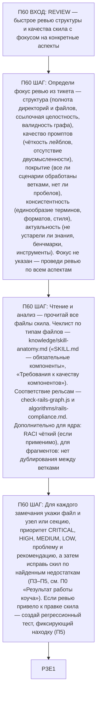

# Воркфлоу: REVIEW — Ревью скила

Фрагмент графа коуча, этап П60. Вход — из П0 по ветке REVIEW; выход — в П3 (правка по замечаниям).

```mermaid
graph TD
    P60E1["П60 ВХОД: REVIEW — быстрое ревью структуры и качества скила с фокусом на конкретные аспекты"]
    P60S1["П60 ШАГ: Определи фокус ревью из тикета — структура (полнота директорий и файлов, ссылочная целостность, валидность графа), качество промптов (чёткость лейблов, отсутствие двусмысленности), покрытие (все ли сценарии обработаны ветками, нет ли пробелов), консистентность (единообразие терминов, форматов, стиля), актуальность (не устарели ли знания, бенчмарки, инструменты). Фокус не указан — проведи ревью по всем аспектам"]
    P60S2["П60 ШАГ: Чтение и анализ — прочитай все файлы скила. Чеклист по типам файлов — knowledge/skill-anatomy.md («SKILL.md — обязательные компоненты», «Требования к качеству компонентов»). Соответствие рельсам — check-rails-graph.js и algorithms/rails-compliance.md. Дополнительно для ядра: RACI чёткий (если применимо), для фрагментов: нет дублирования между ветками"]
    P60S3["П60 ШАГ: Для каждого замечания укажи файл и узел или секцию, приоритет CRITICAL, HIGH, MEDIUM, LOW, проблему и рекомендацию, а затем исправь скил по найденным недостаткам (П3–П5, см. П0 «Результат работы коуча»). Если ревью привело к правке скила — создай регрессионный тест, фиксирующий находку (П5)"]

    P60E1 --> P60S1 --> P60S2 --> P60S3 --> P3E1
```
