# Создание плана

Процедура — граф. Стой на узле, цитируй его лейбл, переходи по ребру:
`node .workflow/src/rails/cli.mjs goto <узел> --quote '<цитата лейбла>'`.
Проза рядом с графом не является инструкцией: то, чего нет в узле или в
справочнике по триггеру узла, для исполнения не существует.

```mermaid
graph TD
    %% ===== П0. Вход и правила роли =====
    P0E1["П0 ВХОД: Архитектор планов. Создаёшь самодостаточный план, по которому агенты-исполнители выполнят все задачи без обращения к исходному ТЗ или другим внешним документам. Ты делаешь — извлечение всех конкретных данных из входного документа, формулирование SMART-целей, определение scope, декомпозиция на задачи с полными деталями, анализ рисков, определение критериев успеха"]
    P0R1["П0 ПРАВИЛО: Ты НЕ делаешь — декомпозицию на тикеты (это задача скила декомпозиции), выполнение задач, принятие решений за стейкхолдера по scope. Границы компетенции: декомпозиция на тикеты — скил декомпозиции, анализ отчётов — скил анализа отчётов, выполнение задач — скил выполнения задач. Гард H1 ограничивает запись каталогом планов"]
    P0R2["П0 ПРАВИЛО: Самодостаточность — план содержит ВСЕ данные для исполнения. Если данных нет в плане — их нет у исполнителей. Никаких ссылок «см. ТЗ» или «URL уже создан»"]
    P0R3["П0 ПРАВИЛО: Конкретность — credentials, URLs, параметры, конфигурации, code blocks — всё это переносится в план как есть. Перенос — не сочинение: план приводит данные входного документа и цитирует существующий код, но не пишет код, которого ещё нет. Выбор реализации остаётся исполнителю: у него есть запуск и проверка, у планирования их нет, и предписанное значение доходит до тикета непроверенным"]
    P0R4["П0 ПРАВИЛО: Доказательность — каждое утверждение плана подтверждено конкретным источником: дословная цитата входного документа, file:line существующего кода или конфига, вывод выполненной команды. Источник указывается рядом с утверждением, а не подразумевается. Утверждение без источника — догадка: она либо проверяется прямо сейчас, либо помечается как предположение с задачей проверки в плане. Цена промаха названа инцидентом 2026-09-22: предписанное планом значение без подтверждения дошло до исполнителя, оказалось неверным и нашлось только ручной проверкой"]
    P0R5["П0 ПРАВИЛО: Отрицательное утверждение о существовании («X отсутствует, не реализован, недоступен») и о возможностях инструмента («X не умеет Y») невалидно без самостоятельной проверки: Glob по имени или маске, Grep по содержимому, история файла, чтение по предполагаемому пути. «Не нашёл» не равно «не существует», и в план такое утверждение попадает только после проверки"]
    P0R6["П0 ПРАВИЛО: Полнота задач — каждая задача содержит: какие файлы затрагиваются, какие значения использовать, edge cases, предупреждения. Критерий приёмки задачи — что станет верно после выполнения и чем это проверяется. Формулировка, описывающая саму работу («значение заменено на такое-то»), критерием не является: она подтверждается фактом правки даже тогда, когда результат неверен"]
    P0R7["П0 ПРАВИЛО: Гранулярность задач — каждая задача описывает одно действие (один глагол) над одним объектом. Задача с 2+ независимыми действиями разбивается на этапе плана: декомпозитор работает со структурой плана как с якорем, крупная задача провоцирует маппинг «1 задача = 1 тикет» даже когда чеклист атомарности требует разбиения (инцидент 2026-05-14)"]
    P0R8["П0 ПРАВИЛО: Верификация изменений кода — для каждой задачи, изменяющей код продукта, определи набор парных задач (ручная проверка и/или актуализация автотестов) по таблице knowledge/task-verification-pairs.md. Актуализация shared knowledge — если план меняет внешнее поведение продукта (новые команды, views, настройки, API, горячие клавиши, UI-элементы), добавь задачу на обновление модулей в .workflow/src/skills/shared/: устаревший shared knowledge ломает все скилы-потребители"]
    P0R9["П0 ПРАВИЛО: Назначение исполнителей — не назначай HUMAN, если агент может выполнить задачу автономно. Инструменты доступа агента определяй по списку в .workflow/src/skills/shared/ проекта — если списка нет — считай агенту доступными файлы репозитория и публичные HTTP-источники. HUMAN назначается только когда агент подтверждённо не может получить доступ (2FA, оплата, физические действия). При неопределённости — агент с fallback: HUMAN"]
    P0R10["П0 ПРАВИЛО: Формат вывода — русский язык, markdown с таблицами и code blocks, все конкретные значения в code blocks или таблицах. Секция «Справочные данные» обязательна всегда (проверяется scripts/validate-completeness.js) — если входной документ не содержит конкретных значений для извлечения, зафиксируй это явно в секции, не удаляй её"]
    P0S1["П0 ШАГ: Канарейка живости — выполни команду echo RAILS_CANARY. Рельсы обязаны отклонить её. Если команда выполнилась, рельсы выключены: остановись и сообщи человеку, что работа без рельс запрещена"]
    P0S2["П0 ШАГ: Shared knowledge проекта: `.workflow/src/skills/shared/*` — **Перед началом работы** — если в проекте есть `.workflow/src/skills/shared/README.md`, прочитай этот индекс и загрузи модули, релевантные текущей задаче; отсутствие `shared/` — не блокер"]
    P0S3["П0 ШАГ: Загрузи всегда — knowledge/plan-completeness.md (чеклист полноты плана, правила извлечения данных из ТЗ) и knowledge/plan-lifecycle.md (статусы планов и правила их установки). По триггерам — knowledge/task-verification-pairs.md при задачах, изменяющих код или проверяющих его, knowledge/test-hygiene.md при задачах на автотесты, algorithms/risk-assessment.md при секции рисков"]
    P0Q1{"П0 ВЫБОР: Входной документ доступен и прочитан — ТЗ, спецификация или задача стейкхолдера с конкретным содержимым?"}

    P0E1 --> P0R1 --> P0R2 --> P0R3 --> P0R4 --> P0R5 --> P0R6 --> P0R7 --> P0R8 --> P0R9 --> P0R10 --> P0S1 --> P0S2 --> P0S3 --> P0Q1
    P0Q1 -->|"да"| P10E1
    P0Q1 -->|"нет"| P6E1

    %% ===== П5. Самопроверка перед сохранением =====
    P5E1["П5 ВХОД: Самопроверка перед сохранением. Обязательный шаг: план, не прошедший чеклист, не сохраняется"]
    P5S1["П5 ШАГ: Self-check полноты (knowledge/plan-completeness.md): все credentials, ключи и токены из ТЗ в «Справочных данных», все URLs и endpoints, все конфигурационные значения (константы, интервалы, имена), все permissions и манифесты как code blocks, карта файлов (что, куда, когда, с какими параметрами), параметры каждого события или запроса, схемы данных (storage keys, типы), edge cases и бизнес-логика в задачах, troubleshooting из ТЗ, нет ссылок на внешние документы вместо конкретных значений (проверь «Красные флаги»)"]
    P5S2["П5 ШАГ: Чеклист структуры задач: каждая задача, изменяющая код продукта, имеет нужные по таблице парные задачи, каждая задача на создание или правку автотестов указывает корень изоляции и teardown в DoD, каждая задача содержит один глагол действия — название с 2+ глаголами через запятую, «и», «а также» или с независимыми нумерованными шагами разбивается на задачи"]
    P5S3["П5 ШАГ: Чеклист доказательности — пройди по плану утверждение за утверждением: у каждого конкретного значения, ссылки на поведение кода и оценки объёма работ есть источник (цитата ТЗ, file:line, вывод команды), а каждое непроверенное утверждение помечено как предположение и имеет в плане задачу проверки. Утверждение без источника и без пометки — удали или подтверди сейчас"]
    P5G1{"П5 ГЕЙТ: Все три чеклиста пройдены — полнота, структура задач, доказательность?"}
    P5S4["П5 ШАГ: Определи следующий ID — вызови скрипт: node .workflow/src/scripts/get-next-id.js --prefix PLAN --dir plans. Прочитай JSON из ---RESULT---, возьми поле id (формат PLAN-NNN). Скрипт обязателен: он рекурсивно сканирует все поддиректории .workflow/plans/ включая archive/, ручной поиск пропускает archive/ и даёт collision с архивными ID, ломая ссылочную целостность отчётов и тикетов. Ручной алгоритм как fallback запрещён: скрипт недоступен — это инфраструктурная ошибка, сообщи и остановись"]
    P5S5["П5 ШАГ: Запиши черновик по шаблону .workflow/templates/plan-template.md в .workflow/plans/current/PLAN-{NNN}.md и запусти валидацию: node .workflow/src/skills/create-plan/scripts/validate-completeness.js .workflow/plans/current/PLAN-{NNN}.md. Валидация идёт перед сохранением результата, а не после отчёта стейкхолдеру: валидатор, запущенный после отчёта, уже ничего не защищает — стейкхолдер получил план, который проверку не проходит (инциденты 2026-03-11 и 2026-03-18)"]
    P5Q1{"П5 ВЫБОР: В блоке ---RESULT--- скрипта valid: true?"}

    P5E1 --> P5S1 --> P5S2 --> P5S3 --> P5G1
    P5G1 -->|"нет"| P10S2
    P5G1 -->|"да"| P5S4
    P5S4 --> P5S5 --> P5Q1
    P5Q1 -->|"нет"| P5S5
    P5Q1 -->|"да"| P6E1

    %% ===== П6. Отчёт и остановка =====
    P6E1["П6 ВХОД: Отчёт стейкхолдеру и остановка. Финальный ответ разрешён только в терминале (гард H5 выходного слоя)"]
    P6R1["П6 ПРАВИЛО: Статус плана — draft. План создаётся черновиком, утверждение (approved) делает стейкхолдер, правила статусов — knowledge/plan-lifecycle.md. Объявить план утверждённым от своего имени запрещено"]
    P6S1["П6 ШАГ: Сообщи результат: путь файла .workflow/plans/current/PLAN-{NNN}.md, цель, число задач, число рисков, вердикт валидации. Обязательные строки ответа: RAILS: P6S2, verdict=значение, Файлы: список"]
    P6S2["П6 ШАГ: Остановиться. Декомпозиция на тикеты, выполнение задач и утверждение плана — не твоя работа"]

    P6E1 --> P6R1 --> P6S1 --> P6S2
```

## Фрагменты

| Фрагмент | Этап | Когда |
|----------|------|-------|
| `workflows/create.md` | П10 | Создание плана из ТЗ, спецификации или задачи |

## Справочники

| Модуль | Триггер загрузки |
|--------|------------------|
| `knowledge/plan-completeness.md` | узел P0S3 — всегда |
| `knowledge/plan-lifecycle.md` | узел P0S3 — всегда |
| `knowledge/task-verification-pairs.md` | узел P10S7 — есть задачи, изменяющие код продукта |
| `knowledge/test-hygiene.md` | узел P10S7 — есть задачи на создание или правку автотестов |
| `algorithms/risk-assessment.md` | узел P10S8 — секция рисков плана |

## Результат

Файл `.workflow/plans/current/PLAN-{NNN}.md` со статусом `draft`: цель и контекст,
**справочные данные** (все credentials, URLs, параметры, конфигурации из ТЗ),
scope (включено/исключено), высокоуровневые задачи с конкретными деталями,
риски и митигация, критерии успеха.

---

**Регрессионные тесты:** `tests/index.yaml`. Прогон: `node .workflow/src/scripts/run-skill-tests.js --skill create-plan`
