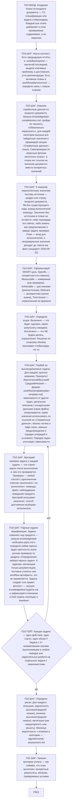

# Фрагмент П10: создание плана

Этап 10 графа скила. Подключается ребром `P0Q1 -->|"создание плана"| P10E1`,
выход — ребро в узел самопроверки ядра `P5E1`.

```mermaid
graph TD
    P10E1["П10 ВХОД: Создание плана из входного документа — ТЗ, спецификации или задачи стейкхолдера. Каждый шаг этапа добавляет в план проверяемое содержимое, а не пересказ"]
    P10S1["П10 ШАГ: Изучи контекст. Есть предыдущие отчёты в .workflow/reports/ — прочитай последний, выдели ключевые проблемы и достижения, учти рекомендации. Есть активные планы в .workflow/plans/current/ — определи связь с новым планом"]
    P10S2["П10 ШАГ: Извлеки справочные данные из входного документа. Загрузи knowledge/plan-completeness.md, пройди по чеклисту «Обязательно переносить», для каждой категории выпиши все найденные значения и сформируй секцию «Справочные данные» плана. Самопроверка по «Красным флагам неполного плана»: в плане нет ссылок на внешние документы вместо конкретных значений"]
    P10S3["П10 ШАГ: К каждому перенесённому значению поставь источник — раздел или строку входного документа, file:line существующего кода, вывод выполненной команды. Значение без источника в плане не остаётся: либо подтверди его сейчас, либо пометь как предположение и заведи задачу проверки. План — вход для исполнителей, и непроверенное значение доходит до тикета как факт (инцидент 2026-09-22)"]
    P10S4["П10 ШАГ: Сформулируй SMART-цель: Specific — конкретная (что именно), Measurable — измеримая (как проверим), Achievable — достижимая (реалистичная), Relevant — релевантная (зачем нужна), Time-bound — ограниченная во времени"]
    P10S5["П10 ШАГ: Определи scope. Включено — что будет сделано, какие результаты ожидаем. Исключено — что НЕ будем делать, ограничения. Решение по спорному объёму принимает стейкхолдер, не ты"]
    P10S6["П10 ШАГ: Разбей на высокоуровневые задачи. Для каждой: краткое название, Приоритет (Критический/Высокий/Средний/Низкий — формат .workflow/templates/plan-template.md), зависимости от других задач, детальное описание с конкретными данными (какие файлы затрагиваются, какие значения использовать со ссылкой на «Справочные данные», бизнес-логика и edge cases, важные предупреждения о порядке операций и условиях). Порядок задач учитывает зависимости"]
    P10S7["П10 ШАГ: Критерий приёмки задачи у каждой задачи — что станет верно после выполнения и чем это проверяется. Проверка — любой способ с однозначным ответом «выполнено / не выполнено»: команда, файл, наблюдаемое поведение продукта. Критерий описывает результат; способ достижения выбирает исполнитель"]
    P10S8["П10 ШАГ: Парные задачи верификации. Задача изменяет код продукта — загрузи knowledge/task-verification-pairs.md и определи набор парных задач (автотесты и/или ручная проверка) по разделу «Определение набора парных задач». К задачам, меняющим только документацию, тестовые утилиты или workflow-артефакты, это не применяется. Задача создаёт или правит автотест — загрузи knowledge/test-hygiene.md и зафиксируй в описании и DoD корень изоляции и teardown"]
    P10G1{"П10 ГЕЙТ: Каждая задача — одно действие, один глагол, один объект? Задача с 2+ независимыми шагами (выполнимыми в любом порядке или параллельно) разбита на отдельные задачи с зависимостями"}
    P10S9["П10 ШАГ: Определи риски. Для каждого: описание, вероятность (высокая/средняя/низкая), влияние (высокое/среднее/низкое), митигация (как предотвратить или решить). Матрица вероятность × влияние и категории — algorithms/risk-assessment.md"]
    P10S10["П10 ШАГ: Запиши критерии успеха — как поймём, что план выполнен: конкретные результаты, метрики, проверяемые условия"]

    P10E1 --> P10S1 --> P10S2 --> P10S3 --> P10S4 --> P10S5 --> P10S6 --> P10S7 --> P10S8 --> P10G1
    P10G1 -->|"нет"| P10S6
    P10G1 -->|"да"| P10S9
    P10S9 --> P10S10 --> P5E1
```
