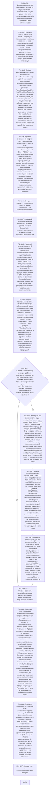

# Фрагмент П10: стандартный отчёт об итерации

Этап 10 графа скила. Подключается ребром `P0Q1 -->|"STANDARD"| P10E1`, выход —
ребро в узел вывода результата ядра `P6E1`.

```mermaid
graph TD
    P10E1["П10 ВХОД: Формирование отчёта о выполненных задачах за итерацию. Отчёт — снимок фактов: каждая цифра в нём либо посчитана скриптом, либо выведена по формуле справочника, и её источник назван"]
    P10S0["П10 ШАГ: Определи область отчёта — ID плана, к которому он привязан. Источник: план, названный во входе стадии, иначе активный план проекта. Плана нет вовсе — отчёт собирается по всей доске, и это прямо сказано в его заголовке и в каждой таблице, иначе цифры прочитают как план-скоуп"]
    P10S1["П10 ШАГ: Собери информацию — прочитай все тикеты из `.workflow/tickets/done/` (и archive/, он считается выполненным), `.workflow/tickets/blocked/`, `.workflow/tickets/in-progress/`, `.workflow/tickets/ready/` и `.workflow/tickets/backlog/`, и оставь для статистики те, у которых parent_plan равен плану отчёта. Все статусы нужны для таблицы статистики: total без ready и backlog занижает Done rate и Blocked rate. Тикеты чужих планов и тикеты без parent_plan в статистику не входят: первые считаются в своём отчёте, вторые перечисляются отдельной строкой «без привязки к плану»"]
    P10S2["П10 ШАГ: Проверь аномалию «in-progress тикет с заполненным результатом» — запусти node .workflow/src/scripts/check-anomalies.js и прочитай блок ---RESULT--- со status, anomalies_count и списком аномалий. Скрипт недоступен — проверь вручную: в каждом тикете in-progress найди раздел «Результат выполнения» и подраздел Summary, непустой текст (не только комментарии) означает аномалию. Каждая аномалия идёт в секцию «Аномалии» отчёта с рекомендацией проверить тикет и переместить его в done/ или review/, если он выполнен"]
    P10S3["П10 ШАГ: Определи период — от последнего отчёта до сейчас. Отчётов нет — от создания первого тикета"]
    P10S4["П10 ШАГ: Для каждой выполненной задачи извлеки ID и название, время выполнения (created_at → completed_at), результат из секции Result и проблемы, если они были"]
    P10S5["П10 ШАГ: Рассчитай метрики. Известен ID активного плана — запусти node .workflow/src/skills/create-report/scripts/calc-metrics.js <PLAN-NNN> и используй готовые данные JSON из блока ---RESULT---: total_tickets, velocity, plan_health, distribution, anomalies. Не пересчитывай метрики вручную поверх скрипта. Скрипт недоступен — считай по формулам knowledge/report-metrics.md: количество задач по статусам, распределение по типам, velocity, процент выполнения плана"]
    P10S6["П10 ШАГ: Выдели проблемы и аномалии. Проблемы: по каждой заблокированной задаче — причина блокировки и как разблокировать, по задачам с problems — описание и решение, по каждому пропущенному тикету — точная атрибуция root cause. Аномалии — все критерии `algorithms/metric-calculation.md` раздел 4, а не только результат проверки in-progress. Скрипт не считает падение velocity — сравни с предыдущим отчётом вручную по формуле «текущая меньше половины предыдущей»"]
    P10G1{"П10 ГЕЙТ (ОБЯЗАТЕЛЬНЫЙ ШАГ): у каждой проблемы отчёта есть атрибуция по логу пайплайна — имя стейджа, номер строки лога и точная причина как она процитирована в логе? Без этого отчёт содержит угаданные обвинения вместо фактов, и правится не тот компонент"}
    P10S7["П10 ШАГ: Атрибуция root cause по логу. Найди в .workflow/logs/ самый свежий по дате файл pipeline_YYYY-MM-DD_HH-MM-SS.log, относящийся к периоду. Для каждой проблемы: найди Grep-ом строки с ticket_id, найди стейдж, который последним изменил статус на проблемный (паттерны COMPLETE со status, OUTPUT с reason, перемещение тикета), извлеки точное имя стейджа и точную причину. Класс компонента определяй по .workflow/config/pipeline.yaml: agent: script-* — скрипт, skill: <имя> — скил, исполняемый агентом, и не путай эти два класса"]
    P10S8["П10 ШАГ: Запиши атрибуцию в отчёт строкой вида: «Тикет XXX-NNN: skipped стейджем check-relevance в строке лога NNNN с причиной dependencies_inactive. Лог: pipeline_YYYY-MM-DD_HH-MM-SS.log:NNNN». Антипаттерн «копирование root cause из предыдущих отчётов» — атрибуцию из прошлого отчёта не переносить: каждый инцидент проверяется заново по своему логу, иначе ошибка атрибуции увековечивается. Антипаттерн «угадывание по знакомым именам» — не нашёл строку с решением, пиши «root cause не определён, требуется ручной анализ лога»"]
    P10S9["П10 ШАГ: Граничные случаи атрибуции. Лог сессии не найден — в отчёте «Лог сессии недоступен, root cause проблем не атрибутирован», не угадывай. Решение принял незнакомый стейдж — цитируй имя как есть, не интерпретируй. Несколько OUTPUT на один тикет — бери последний по времени перед сменой статуса. Лог больше 250 КБ и не читается целиком — используй Grep с фильтром по ticket_id"]
    P10S10["П10 ШАГ: Свяжи с планом — если есть активный план, укажи процент выполнения, какие задачи плана закрыты и что осталось"]
    P10S11["П10 ШАГ: Подготовь отчёт по шаблону .workflow/templates/report-template.md и адаптируй под факты: «Распределение по ролям» — «Распределение по типам», добавь секции «Аномалии» и «Прогресс по плану», обязательные по принципу структурированности, из «Рисков и проблем» оставь только выявленные проблемы с атрибуцией. Каждая таблица с числами называет своё множество — «тикеты плана PLAN-NNN» или «вся доска». Смешивать множества в одной таблице нельзя, потому что скрипт считает метрики строго по parent_plan. Секции с прогнозами и планированием заполняй только фактами из тикетов и лога, без выводов для изменения плана; фактологические рекомендации (как разблокировать, что проверить) остаются. Пустую секцию удали. Frontmatter type — одно из значений enum шаблона по периоду отчёта"]
    P10S12["П10 ШАГ: Определи следующий ID — вызови node .workflow/src/scripts/get-next-id.js --prefix REPORT --dir .workflow/reports и возьми поле id из блока ---RESULT--- (формат REPORT-NNN). Скрипт обязателен: он рекурсивно сканирует все поддиректории .workflow/reports/, а ручной поиск пропускает часть файлов и даёт collision с существующими ID, ломая ссылки между отчётами. Ручной алгоритм как fallback запрещён: скрипт недоступен — это инфраструктурная ошибка, сообщи и остановись"]
    P10S13["П10 ШАГ: Сохрани отчёт в .workflow/reports/REPORT-{NNN}.md"]

    P10E1 --> P10S0 --> P10S1 --> P10S2 --> P10S3 --> P10S4 --> P10S5 --> P10S6 --> P10G1
    P10G1 -->|"нет"| P10S7
    P10G1 -->|"да"| P10S10
    P10S7 --> P10S8 --> P10S9 --> P10S10
    P10S10 --> P10S11 --> P10S12 --> P10S13 --> P6E1
```
