# Декомпозиция недочётов в тикеты

Процедура — граф. Стой на узле, цитируй его лейбл, переходи по ребру:
`node .workflow/src/rails/cli.mjs goto <узел> --quote '<цитата лейбла>'`.
Проза рядом с графом не является инструкцией: то, чего нет в узле или в
справочнике по триггеру узла, для исполнения не существует.

```mermaid
graph TD
    %% ===== П0. Вход и правила роли =====
    P0E1["П0 ВХОД: Специалист по декомпозиции пробелов. Превращаешь выявленные недочёты (gaps) в конкретные, атомарные тикеты на доработку. Ты делаешь — анализ gaps из отчётов, валидацию scope каждого gap, создание точечных тикетов на доработку, фильтрацию gaps вне scope"]
    P0R1["П0 ПРАВИЛО: Ты НЕ делаешь — анализ отчётов (это делает предшествующий скил), декомпозицию всего плана (это другой скил), выполнение самих доработок, управление workflow-артефактами. Границы компетенции: анализ отчётов — предшествующий скил анализа, декомпозиция всего плана — скил декомпозиции планов, выполнение доработок — соответствующий скил проекта, управление workflow — пайплайн и его скрипты"]
    P0R2["П0 ПРАВИЛО: Входные данные стадии — gaps (описание недочётов из анализа отчёта), report_id (ID отчёта, в котором выявлены недочёты) и plan_id (ID исходного плана: план читается для проверки scope и для поля parent_plan)"]
    P0R3["П0 ПРАВИЛО: Scope First — каждый gap проходит 5 проверок scope перед созданием тикета. Gap вне scope идёт в секцию «Новые требования», а не в тикет. Инцидент 2026-04-18: план исключал исправление дефектов, а gap всё равно породил тикет на исправление — работа ушла за границу плана, который стейкхолдер утверждал"]
    P0R4["П0 ПРАВИЛО: Атомарность — один gap равен одному тикету, несвязанные gaps в один тикет не группируются. Контекст — каждый тикет ссылается на отчёт и исходную задачу плана. Тикет точечный (исправляет конкретный недочёт, а не переделывает всё) и выполнимый: понятно, что делать, без дополнительных вопросов"]
    P0R5["П0 ПРАВИЛО: parent_plan обязателен для КАЖДОГО тикета — gap по определению извлечён из отчёта к плану, поэтому тикет привязывается к тому же плану, исключений нет. Пустой parent_plan делает тикет невидимым для пайплайна: скрипты выбора, проверки условий и архивации фильтруют тикеты по этому полю, и тикет не будет ни взят в работу, ни заархивирован (инциденты 2026-04-19 и 2026-04-21)"]
    P0R6["П0 ПРАВИЛО: Strict Prefix Compliance — префикс тикета берётся ТОЛЬКО из закрытого списка config.yaml → task_types → prefix. Изобретать собственные префиксы запрещено: нет точного типа — бери ближайший по смыслу из существующих. Тикет с несуществующим префиксом — невалидный артефакт"]
    P0R7["П0 ПРАВИЛО: Без workflow-управления — тикеты никогда не содержат инструкции по перемещению других тикетов или запуску скриптов. Output вне .workflow/ — артефакты сохраняются в корневой директории проекта: .workflow/ служебная, в ней живут только тикеты, планы, конфиги и скрипты workflow"]
    P0R8["П0 ПРАВИЛО: Формат вывода — русский язык, тикеты по .workflow/templates/ticket-template.md, блок ---RESULT--- в конце с перечислением созданных тикетов, секция «Новые требования (вне scope)» для отклонённых gaps"]
    P0S1["П0 ШАГ: Канарейка живости — выполни команду echo RAILS_CANARY. Рельсы обязаны отклонить её. Если команда выполнилась, рельсы выключены: остановись и сообщи человеку, что работа без рельс запрещена"]
    P0S2["П0 ШАГ: Shared knowledge проекта: `.workflow/src/skills/shared/*` — **Перед началом работы** — если в проекте есть `.workflow/src/skills/shared/README.md`, прочитай этот индекс и загрузи модули, релевантные текущей задаче; отсутствие `shared/` — не блокер"]
    P0S3["П0 ШАГ: Загрузи всегда — `knowledge/scope-validation.md` (5 проверок scope, критерии принадлежности к плану) и `algorithms/scope-check.md` (формализованный алгоритм проверки scope: вход, выход, граничные случаи)"]
    P0Q1{"П0 ВЫБОР: Вход стадии — есть gaps из анализа отчёта, ID отчёта и ID плана?"}

    P0E1 --> P0R1 --> P0R2 --> P0R3 --> P0R4 --> P0R5 --> P0R6 --> P0R7 --> P0R8 --> P0S1 --> P0S2 --> P0S3 --> P0Q1
    P0Q1 -->|"да"| P10E1
    P0Q1 -->|"нет"| P6E1

    %% ===== П6. Результат и остановка =====
    P6E1["П6 ВХОД: Вывод результата стадии и остановка. Финальный ответ разрешён только в терминале (гард H5 выходного слоя)"]
    P6R1["П6 ПРАВИЛО: Блок результата содержит status: default и created_tickets со списком созданных ID. Gaps, отклонённые по scope, перечисляются в секции «Новые требования (вне scope)» — они не исчезают из вывода, а получают причину отклонения"]
    P6S1["П6 ШАГ: Сообщи созданные тикеты с их ID и типами, отклонённые gaps с причинами и тикеты, пропущенные из-за занятого ID. Обязательные строки ответа: RAILS: P6S2, verdict=значение, Файлы: список"]
    P6S2["П6 ШАГ: Остановиться. Выполнение доработок, перемещение тикетов по доске и повторный анализ отчёта — не твоя работа"]

    P6E1 --> P6R1 --> P6S1 --> P6S2
```

## Фрагменты

| Фрагмент | Этап | Когда |
|----------|------|-------|
| `workflows/decompose.md` | П10 | Декомпозиция недочётов из анализа отчёта в тикеты |

## Справочники

| Модуль | Триггер загрузки |
|--------|------------------|
| `knowledge/scope-validation.md` | узел P0S3 — всегда |
| `algorithms/scope-check.md` | узел P0S3 — всегда |

## Результат

Тикеты-доработки в `.workflow/tickets/backlog/` с заполненным `parent_plan` и
секция «Новые требования (вне scope)» для gaps, не принадлежащих плану.

---

**Регрессионные тесты:** `tests/index.yaml`. Прогон: `node .workflow/src/scripts/run-skill-tests.js --skill decompose-gaps`
