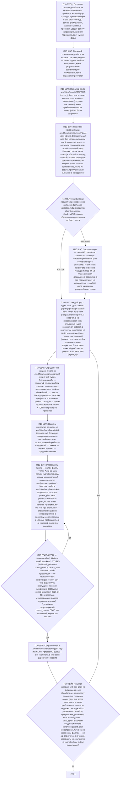

# Фрагмент П10: декомпозиция недочётов в тикеты

Этап 10 графа скила. Подключается ребром `P0Q1 -->|"да"| P10E1`, выход — ребро в
узел вывода результата ядра `P6E1`.

```mermaid
graph TD
    P10E1["П10 ВХОД: Создание тикетов-доработок на основе выявленных пробелов. Каждый gap проходит проверку scope и оба стоп-гейта ДО записи файла: тикет, записанный мимо проверки, уводит работу за границу плана или перезаписывает чужой файл"]
    P10S1["П10 ШАГ: Прочитай описание недочётов из входного параметра gaps — какие задачи не были выполнены, какие результаты не соответствуют ожиданиям, какие доработки требуются"]
    P10S2["П10 ШАГ: Прочитай отчёт .workflow/reports/REPORT-{report_id}.md для полного контекста — что было выполнено (текущее состояние), какие проблемы возникли, какие файлы были затронуты"]
    P10S3["П10 ШАГ: Прочитай исходный план .workflow/plans/current/PLAN-{plan_id}.md. Обязательный шаг: без него невыполним шаг 4, проверка scope — алгоритм принимает план как обязательный вход. Извлеки список задач плана (чтобы найти задачу, которой соответствует gap), секцию «Исключено из scope», status плана и признак того, была ли задача пропущена или выполнена некорректно"]
    P10G1{"П10 ГЕЙТ: каждый gap прошёл 5 проверок scope по knowledge/scope-validation.md и алгоритму algorithms/scope-check.md? Проверка обязательна до создания любого тикета"}
    P10S4["П10 ШАГ: Gap вне scope — тикет НЕ создаётся. Запиши его в секцию «Новые требования (вне scope плана)» с описанием и причиной, почему это вне scope. Инцидент 2026-04-18: план исключал исправление дефектов, а gap породил тикет на исправление — работа ушла за границу утверждённого плана"]
    P10S5["П10 ШАГ: Каждый gap → один тикет. Для каждого gap внутри scope создай один тикет: точечный (исправляет конкретный недочёт, а не переделывает всё), атомарный (одна конкретная работа), с контекстом (ссылается на отчёт и исходную задачу плана), выполнимый (понятно, что делать, без дополнительных вопросов). В описании укажи «Доработка по результатам REPORT-{report_id}»"]
    P10S6["П10 ШАГ: Определи тип каждого тикета по .workflow/config/config.yaml, секция task_types. Значения prefix — закрытый список: выбери префикс только из него, нет точного типа — бери ближайший по смыслу. Валидация перед записью: префикс в id и в имени файла совпадает с одним из prefix конфига, иначе СТОП и исправление префикса"]
    P10S7["П10 ШАГ: Назначь приоритет по шкале из .workflow/templates/ticket-template.md: блокирует завершение плана — высший приоритет шкалы, важный пробел — следующий по важности, мелкий недочёт — средний или ниже"]
    P10S8["П10 ШАГ: Определи ID тикета — найди файлы {TYPE}-*.md во всех папках .workflow/tickets/, возьми максимальный номер для этого префикса и прибавь 1. Заполни шаблон .workflow/templates/ticket-template.md, включая parent_plan вида plans/current/PLAN-{plan_id}.md. Тикет кажется «системным» или «не про этот план» — это признак gap вне scope: верни его в проверку scope и запиши в «Новые требования», а не создавай тикет без привязки"]
    P10G2{"П10 ГЕЙТ (СТОП, до записи файла): Glob по .workflow/tickets/**/{TYPE}-{NNN}.md даёт ноль совпадений И parent_plan заполнен? Файл существует — не перезаписывай: зафиксируй «Тикет {ID} уже существует, пропущен» и возьми следующий свободный номер (инцидент 2026-04-18: перезапись существующих тикетов другими стадиями). Пустой или отсутствующий parent_plan — СТОП, не записывай, вернись и заполни"}
    P10S9["П10 ШАГ: Сохрани тикет в .workflow/tickets/backlog/{TYPE}-{NNN}.md. Артефакты output — вне .workflow/, в корневой директории проекта"]
    P10G3{"П10 ГЕЙТ (чеклист завершения): все gaps из входных данных обработаны, по каждому выполнена проверка scope, gaps вне scope записаны в «Новые требования», тикеты не содержат инструкций по управлению workflow, префикс каждого тикета есть в config.yaml → task_types, в каждом созданном тикете заполнен parent_plan (перепроверь Grep-ом по созданным файлам — ни одного пустого значения), артефакты не ссылаются на .workflow/ как output-директорию?"}

    P10E1 --> P10S1 --> P10S2 --> P10S3 --> P10G1
    P10G1 -->|"вне scope"| P10S4
    P10G1 -->|"в scope"| P10S5
    P10S4 --> P10S5
    P10S5 --> P10S6 --> P10S7 --> P10S8 --> P10G2
    P10G2 -->|"да"| P10S9
    P10G2 -->|"нет"| P10S8
    P10S9 --> P10G3
    P10G3 -->|"нет"| P10S5
    P10G3 -->|"да"| P6E1
```
