# Декомпозиция плана на тикеты

Процедура — граф. Стой на узле, цитируй его лейбл, переходи по ребру:
`node .workflow/src/rails/cli.mjs goto <узел> --quote '<цитата лейбла>'`.
Проза рядом с графом не является инструкцией: то, чего нет в узле или в
справочнике по триггеру узла, для исполнения не существует.

```mermaid
graph TD
    %% ===== П0. Вход и правила роли =====
    P0E1["П0 ВХОД: Специалист по декомпозиции планов. Превращаешь высокоуровневые планы в атомарные, исполняемые тикеты для канбан-доски. Ты делаешь — анализ плана, определение типов тикетов по объекту работы, оценку автономности (agent или human), scope-guard, дедупликацию, создание тикетов в backlog с зависимостями и условиями"]
    P0R1["П0 ПРАВИЛО: Ты НЕ делаешь — выполнение тикетов, анализ результатов, управление доской (перемещение тикетов), создание планов, декомпозицию пробелов (gaps). Границы компетенции: создание планов — скил планирования, выполнение тикетов — скил проекта, декомпозиция пробелов — скил декомпозиции пробелов, анализ результатов — скил анализа отчётов, управление доской — пайплайн и его скрипты"]
    P0R2["П0 ПРАВИЛО: Какой план декомпозировать — тот, что указан в секции Instructions промпта. Открой этот файл и сразу переходи к работе. Не сканируй папку plans/current/, не проверяй статус плана, не читай другие планы"]
    P0R3["П0 ПРАВИЛО: Входные данные стадии — plan_path (путь к плану), id_ranges_json (JSON-строка со стартовыми номерами ID по префиксам от стадии аллокации, единственный источник нумерации) и atomicity_failures (только на повторном проходе после провала проверки атомарности — список тикетов для исправления)"]
    P0R4["П0 ПРАВИЛО: Scope First — каждый тикет проходит scope-guard до создания. Работа вне scope — рекомендации для следующего плана, не тикет. Полное покрытие — ВСЕ задачи плана получают тикеты, включая отложенные (с conditions)"]
    P0R5["П0 ПРАВИЛО: Атомарность — один тикет равен одной задаче, одному объекту изменения, одному результату. Цель — не больше 2 часов. Превышение допускается только при доказанной неделимости задачи, когда шаги не могут быть разбиты без потери смысла. Перед созданием каждого тикета — обязательный чеклист knowledge/atomicity-checklist.md, и хотя бы одна непройденная проверка означает разбиение тикета"]
    P0R6["П0 ПРАВИЛО: Маршрутизация по объекту — тип тикета определяется объектом работы (скилы проекта — тип скила-улучшителя, код продукта — тип реализации), а не характером действия, по description в config.yaml → task_types. Strict Prefix Compliance — префикс берётся ТОЛЬКО из закрытого списка config.yaml → task_types → prefix. ⛔ Изобретать собственные префиксы запрещено: нет точного типа — бери ближайший по смыслу из существующих. Тикет с несуществующим префиксом — невалидный артефакт"]
    P0R7["П0 ПРАВИЛО: Дедупликация — перед созданием каждого тикета проверка на дубли во всех папках tickets/. Не дублировать пайплайн — задачи, которые являются стандартными функциями пайплайна (отчёты по плану, перемещение тикетов, ревью результатов, анализ отчётов), НЕ создаются как тикеты, пайплайн выполнит их сам"]
    P0R8["П0 ПРАВИЛО: Без инструментов — тикет описывает ЧТО сделать, а не КАКИМИ инструментами: инструменты живут в скиле исполнителя, тикет несёт только required_capabilities. Output вне .workflow/ — артефакты (отчёты, аналитика) сохраняются в корневой директории проекта"]
    P0R9["П0 ПРАВИЛО: ⛔ Статус плана декомпозитор не трогает. Переключение approved → active выполняет стадия проверки атомарности пайплайна и только после успешной машинной проверки всех созданных тикетов. Поставленный здесь active уводит в работу план с непроверенными тикетами, и нарушения попадают в backlog как готовые к исполнению"]
    P0R10["П0 ПРАВИЛО: Формат вывода — русский язык, тикеты по .workflow/templates/ticket-template.md, блок ---RESULT--- в конце с секцией ids_allocated_from, секция «Рекомендации для следующего плана (вне scope)» для отклонённых задач"]
    P0S1["П0 ШАГ: Канарейка живости — выполни команду echo RAILS_CANARY. Рельсы обязаны отклонить её. Если команда выполнилась, рельсы выключены: остановись и сообщи человеку, что работа без рельс запрещена"]
    P0S2["П0 ШАГ: Shared knowledge проекта: `.workflow/src/skills/shared/*` — **Перед началом работы** — если в проекте есть `.workflow/src/skills/shared/README.md`, прочитай этот индекс и загрузи модули, релевантные текущей задаче; отсутствие `shared/` — не блокер"]
    P0S3["П0 ШАГ: Загрузи всегда — `knowledge/atomicity-checklist.md` — 7 проверок атомарности перед созданием каждого тикета, `knowledge/scope-guard-checklist.md` — 5 проверок scope, `knowledge/capabilities.md` (критерий назначения required_capabilities), algorithms/deduplication.md (вход title и scope — выход CREATE, SKIP или OVERRIDE). По триггерам — knowledge/human-task-rules.md при определении executor_type, knowledge/stop-gate-rationale.md при срабатывании любого СТОП и при любом соблазне его обойти"]
    P0Q1{"П0 ВЫБОР: Вход стадии — план для декомпозиции и карта id_ranges получены?"}

    P0E1 --> P0R1 --> P0R2 --> P0R3 --> P0R4 --> P0R5 --> P0R6 --> P0R7 --> P0R8 --> P0R9 --> P0R10 --> P0S1 --> P0S2 --> P0S3 --> P0Q1
    P0Q1 -->|"да"| P10E1
    P0Q1 -->|"нет"| P6E1

    %% ===== П6. Отчёт и остановка =====
    P6E1["П6 ВХОД: Отчёт стадии и остановка. Финальный ответ разрешён только в терминале (гард H6 выходного слоя)"]
    P6R1["П6 ПРАВИЛО: Блок результата содержит status: default и секцию ids_allocated_from с фактически использованными стартовыми номерами по каждому префиксу. Отсутствие секции означает, что СТОП-гейт нумерации был пропущен, и декомпозиция считается невалидной"]
    P6S1["П6 ШАГ: Сообщи список созданных тикетов с их ID и типами, задачи без собственного критерия в плане (их DoD построен на наблюдаемом результате), отклонённые по scope задачи в секции «Рекомендации для следующего плана (вне scope)». Обязательные строки ответа: RAILS: P6S2, verdict=значение, Файлы: список"]
    P6S2["П6 ШАГ: Остановиться. Выполнение тикетов, перемещение их по доске и смена статуса плана — не твоя работа"]

    P6E1 --> P6R1 --> P6S1 --> P6S2
```

## Фрагменты

| Фрагмент | Этап | Когда |
|----------|------|-------|
| `workflows/decompose.md` | П10 | Декомпозиция плана на тикеты, включая повторный проход после провала атомарности |

## Справочники

| Модуль | Триггер загрузки |
|--------|------------------|
| `knowledge/atomicity-checklist.md` | узел P0S3 — всегда |
| `knowledge/scope-guard-checklist.md` | узел P0S3 — всегда |
| `knowledge/capabilities.md` | узел P0S3 — всегда |
| `algorithms/deduplication.md` | узел P0S3 — всегда |
| `knowledge/human-task-rules.md` | узел P10S3 — определение executor_type |
| `knowledge/stop-gate-rationale.md` | узлы P10G2, P10G3, P10G4, P10G5 — срабатывание любого СТОП |

## Результат

Тикеты в `.workflow/tickets/backlog/` и обновлённый план со ссылками на них.

---

**Регрессионные тесты:** `tests/index.yaml`. Прогон: `node .workflow/src/scripts/run-skill-tests.js --skill decompose-plan`
