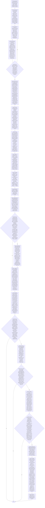

# Фрагмент П10: декомпозиция плана на тикеты

Этап 10 графа скила. Подключается ребром `P0Q1 -->|"да"| P10E1`, выход — ребро
в узел отчёта ядра `P6E1`.

```mermaid
graph TD
    P10E1["П10 ВХОД: Декомпозиция плана. Каждый тикет проходит чеклисты и стоп-гейты ДО записи файла: после записи цена ошибки — повторный проход всей стадии, а у коллизии ID — сломанная ссылочная целостность"]
    P10S1["П10 ШАГ: Прочитай план по пути plan_path из Instructions. Извлеки список задач, зависимости, приоритеты, контекст проекта, секции «Включено в scope» и «Исключено из scope». Повторный проход (на входе есть atomicity_failures) — сначала прочитай узел P10S12: список актуален, если хотя бы один ID из него является файлом в backlog/, чей parent_plan указывает на текущий план, иначе это первый проход"]
    P10S2["П10 ШАГ: Задача плана — кандидат на разбиение, а не готовый тикет. Одна задача плана может и часто должна превратиться в 2+ тикетов, количество тикетов не меньше количества задач плана. ⛔ Маппинг «1 задача = 1 тикет» — антипаттерн: он означает, что чеклист атомарности не был применён, а задачи плана просто переформатированы в шаблон тикета"]
    P10S3["П10 ШАГ: Для каждого тикета-кандидата выпиши inline-таблицу результатов 7 проверок атомарности из knowledge/atomicity-checklist.md. Целевой размер тикета — объём не больше 200 строк кода и время не больше 2 часа (превышение — только при доказанной неделимости задачи). Голый PASS невалиден: у каждой проверки с PASS обязательна колонка Evidence с цитатой из содержимого тикета. Факты противоречат PASS (в title 2+ глагола, шаги параллельны, DoD-пункты несвязаны) — измени результат на FAIL. Факты первичны, интуиция вторична"]
    P10G1{"П10 ГЕЙТ: Все 7 проверок атомарности PASS с цитатами? Хотя бы один FAIL — тикет не создаётся в текущем виде: разбей по паттернам чеклиста и повтори проверку для каждой части. Объединять или сжимать шаги и DoD-пункты вместо разбиения запрещено (антипаттерн «сжатие вместо разбиения»)"}
    P10S4["П10 ШАГ: Парные тикеты ручной проверки. Условие А — у задачи плана есть секция верификации и она требует отдельного окружения или действий, недоступных в основном тикете. Условие Б — задача меняет файлы из реестра observable-инвариантов проектного .workflow/src/skills/shared/, тогда парный тикет создаётся независимо от наличия секции верификации. Условие В — план в сумме затрагивает больше двух файлов observable-зоны или модифицирует декларативный manifest продукта: дополнительно один сводный тикет regression sweep, последний в цепочке зависимостей. Условие Г — сценарий требует состояния среды, которое не возникает само: prep-тикет, готовящий окружение и являющийся зависимостью тикета проверки"]
    P10S5["П10 ШАГ: Что считать observable-зоной и декларативным manifest — определяется исключительно проектным .workflow/src/skills/shared/. Реестра или списка файловых триггеров там нет — это пробел shared: сообщи стейкхолдеру и НЕ применяй условия Б и В, критерии в декомпозиции не изобретай. Парный тикет несёт dependencies на основной, сценарий верификации и требование: evidence обязательно из реального runtime продукта, повторный прогон существующих автотестов на те же файлы evidence ручной проверки не является. Антипаттерн — одна сводная задача «Ручная проверка задач 1-N» на несколько независимых областей"]
    P10S6["П10 ШАГ: Оцени автономность каждой задачи — маршрутизация двухступенчатая, для HUMAN обязательны оба условия: агент физически не может выполнить задачу (нет инструмента, доступа, прав) И задача подпадает под критерий таблицы «Когда задача = HUMAN» из knowledge/human-task-rules.md. Гибридная задача разбивается на два тикета с зависимостью. Недоступность агенту есть, а HUMAN-семантика не подтверждена — тикет не создаётся вовсе, действие выполняет стейкхолдер вне пайплайна. Антипаттерн «fallback в HUMAN» — FAIL на первом условии без проверки второго"]
    P10S7["П10 ШАГ: Определи тип каждого тикета по объекту работы: скилы проекта — тип скила-улучшителя, код продукта — тип реализации или исправления, конфигурация workflow — тип реализации или административный, документация продукта — тип документации, а конкретные ключи и префиксы берутся по description из config.yaml → task_types. Валидация перед записью файла: префикс в id и в имени файла совпадает с одним из prefix в config.yaml → task_types, иначе СТОП и исправление префикса"]
    P10S8["П10 ШАГ: Определи зависимости и условия каждого тикета: dependencies — задачи, которые должны быть выполнены ДО этой, conditions — дополнительные условия. Типы условий: tasks_completed, date_after, date_before, file_exists, file_not_exists, file_contains, manual_approval. Приоритеты: 1 — Critical (блокирует всё), 2 — High (важно для прогресса), 3 — Medium (стандартная работа), 4 — Low (можно отложить), 5 — Someday"]
    P10S9["П10 ШАГ: Scope-guard по knowledge/scope-guard-checklist.md — 5 проверок перед созданием каждого тикета. Тикеты вне scope уходят в секцию «Рекомендации для следующего плана», а не в backlog"]
    P10S10["П10 ШАГ: Дедупликация по algorithms/deduplication.md — проверка на дубли во ВСЕХ папках tickets/ перед созданием каждого тикета. Вызови скрипт: node .workflow/src/skills/decompose-plan/scripts/check-duplicates.js --title «Заголовок тикета» --scope «Описание scope работы», прочитай JSON из ---RESULT--- со списком кандидатов и процентами совпадения и прими решение CREATE, SKIP или OVERRIDE. Скрипт — вспомогательный инструмент, финальное решение за агентом"]
    P10G2{"П10 ГЕЙТ (СТОП, до любых Write и Edit): дословный перенос формулировок критериев из плана. Источник правды для критериев задачи — план, действует правило семантической неизменности. Смягчающие преобразования запрещены: отрицания и запреты («не X», «без Y», «кроме Z», «исключая», «не допускается»), уточнения в скобках и после тире, количественные пороги («не менее N», «ровно N», «не более N% diff»), парные ограничения («X и Y одновременно», «X, но не Y», «только при Z») и референсы на артефакты (имена файлов, селекторы, ID элементов) переносятся дословно либо с эквивалентной семантикой. Обогащение разрешено — запрещено только ослабление"}
    P10S11["П10 ШАГ: Процедура diff-а формулировок перед записью тикета: выпиши дословную строку критерия из плана, выпиши дословную строку критерия тикета, построчно сопоставь отрицания, уточнения, пороги, парные ограничения и референсы. Хотя бы один элемент плана отсутствует в тикете и эквивалента нет — СТОП, верни элемент дословно. Спорный эквивалент — предпочти дословный перенос: дословность никогда не бывает ошибкой, переформулировка может быть. Переформулировка допустима только если она однозначно отвергает любую ситуацию, которую отвергает план"]
    P10S12["П10 ШАГ: У задачи плана нет своего критерия — DoD не изготавливается из формулировки действия: «значение заменено на такое-то» проверяют факт правки, а не результат, и подтверждается даже при неверном решении. Порядок: взять критерий, который план задаёт этой задаче, критерии заданы только на уровне всего плана — перенести дословно ту их часть, которую закрывает задача, проверяемого результата нет нигде в плане — записать в DoD наблюдаемый результат задачи и перечислить такие задачи в выводе стадии. Декомпозиция на этом не останавливается: повторный проход прочитает тот же план и повторит ту же формулировку, а стоимость прохода будет оплачена заново"]
    P10S18["П10 ШАГ: Проверка пункта DoD переносится вместе с ним. Под каждым пунктом DoD — дословным критерием плана — вложенным пунктом идёт запись из строки «**Проверка:**» этого критерия в плане, без изменений: check с expect (и regression: `true`, если так в плане), prose с причиной или visual с путём изображения. У критерия в плане нет строки проверки — вложенный пункт prose: `в плане нет проверки`. Тикет с такими пунктами несёт во frontmatter dod_format: 2 по шаблону тикета: по записи пайплайн исполняет проверку и собирает evidence для ревью, а изменённая при переносе запись проверяет не то, что задал план"]
    P10G3{"П10 ГЕЙТ (СТОП, до любых Write и Edit): нумерация из id_ranges со входа стадии. Распарси id_ranges_json, составь множество префиксов этой декомпозиции и убедись, что каждый присутствует в карте. Префикса нет — это инфраструктурная ошибка (рассинхрон config.yaml → task_types с маршрутизацией, сбой стадии аллокации или пустой либо некорректный JSON): СТОП, сообщи о проблеме и не продолжай. Не изобретай N_start и не используй ручной алгоритм как fallback: ⛔ ручной алгоритм как fallback запрещён: get-next-id.js не вызывается, и ты не сканируешь .workflow/tickets/ для определения номера"}
    P10S13["П10 ШАГ: Все тикеты одного префикса нумеруй строго последовательно от id_ranges[PREFIX]: первый получает {PREFIX}-{N_start}, второй {PREFIX}-{N_start+1} и так далее. Никогда не начинай нумерацию с 001 и не перезапускай её. Зафиксируй фактически использованный диапазон в финальном блоке ---RESULT--- секцией ids_allocated_from с теми же значениями, что пришли во входном id_ranges для использованных префиксов: это обязательная часть контракта стадии"]
    P10G4{"П10 ГЕЙТ (СТОП, до любых Write и Edit тикетов): выписка реестра required_capabilities. Прочитай pipeline-конфиг проекта (стандартный путь .workflow/config/pipeline.yaml, в проекте может быть другой — ориентируйся на фактический), выпиши в рассуждении явным списком union всех значений agents.*.capabilities как capabilities_registry. Значения берутся только из фактического конфига текущего проекта — не из памяти и не из других проектов. Без явной фиксации реестра стоп-гейт считается пропущенным, а контракт стадии нарушенным"}
    P10S14["П10 ШАГ: Создание каждого тикета. Прочитай шаблон .workflow/templates/ticket-template.md, заполни его, обязательно parent_plan. Структура заголовков точно по шаблону: секция DoD — самостоятельный блок уровня ## («## Критерии готовности (Definition of Done)» или «## Definition of Done»), не вложенный в другую секцию. Нарушение уровня заголовка делает тикет невидимым для автоматических проверок пайплайна и приводит к бесконечному циклу ретраев. ID тикета — только из диапазона со входа: план никогда не задаёт ID, похожее на ID в плане игнорируется и трактуется максимум как hint для маппинга строки плана на тикет"]
    P10G5{"П10 ГЕЙТ (СТОП на каждый тикет, до записи): каждый ключ required_capabilities присутствует в capabilities_registry из узла P10G4, и Пре-валидация занятости ID (Glob по .workflow/tickets/**/{TYPE}-{NNN}.md) даёт 0 совпадений. Ключа нет в реестре — не записывай его: изобретённый ключ немедленно блокирует тикет пайплайном по no_capable_agent, поэтому убери ключ, если это описание задачи (язык, платформа, подсистема), замени на ключ реестра при сохранении смысла или оставь поле пустым. Есть совпадение** — СТОП до записи: ID уже занят: не создавай файл, ничего не удаляй, не перевыделяй диапазон и не сдвигай номер вручную, сообщи ID и путь существующего файла и останови декомпозицию"}
    P10S15["П10 ШАГ: Сохрани тикет в .workflow/tickets/backlog/{TYPE}-{NNN}.md. Glob из узла P10G5 — проверка занятости пути, а не источник нумерации: его результат никогда не используется для выбора номера. Артефакты output — вне .workflow/, в корневой директории проекта. Инструменты исполнителя в тикете не указываются — только required_capabilities"]
    P10S16["П10 ШАГ: Повторный проход после провала атомарности. Шаги этапа выполняются ТОЛЬКО для тикетов из atomicity_failures и их новых частей, остальные задачи плана пропускаются — их тикеты уже прошли проверку. правь только тикеты из atomicity_failures через `Edit` существующего файла в backlog/, и перед `Edit` сверь: parent_plan указывает на текущий план, id равен ID из atomicity_failures. Несовпадение или отсутствие файла — СТОП, сообщи ID и не создавай файл с этим ID. Разбиение на 2+: сначала создай файлы всех новых частей, и только после успешной записи всех сузь исходный файл через Edit; не редактируй исходный тикет, пока не созданы все остальные части — первая часть остаётся в исходном файле, ID не меняется, а при дедупликации исходный тикет по его ID не считается дубликатом своих частей. У каждого тикета, в чьих dependencies или conditions есть ID разбиваемого тикета, добавь ID всех новых частей в то же поле, иначе зависимый тикет станет готовым после одной части"]
    P10S17["П10 ШАГ: Обнови план — добавь ссылки на созданные тикеты. Поле status плана не трогай: его переключает стадия проверки атомарности пайплайна"]

    P10E1 --> P10S1 --> P10S2 --> P10S3 --> P10G1
    P10G1 -->|"нет"| P10S2
    P10G1 -->|"да"| P10S4
    P10S4 --> P10S5 --> P10S6 --> P10S7 --> P10S8 --> P10S9 --> P10S10 --> P10G2
    P10G2 -->|"нет"| P10S11
    P10G2 -->|"да"| P10S12
    P10S11 --> P10S12 --> P10S18 --> P10G3
    P10G3 -->|"да"| P10S13
    P10G3 -->|"нет"| P6E1
    P10S13 --> P10G4
    P10G4 -->|"да"| P10S14
    P10G4 -->|"нет"| P6E1
    P10S14 --> P10G5
    P10G5 -->|"да"| P10S15
    P10G5 -->|"нет"| P6E1
    P10S15 --> P10S16 --> P10S17 --> P6E1
```
