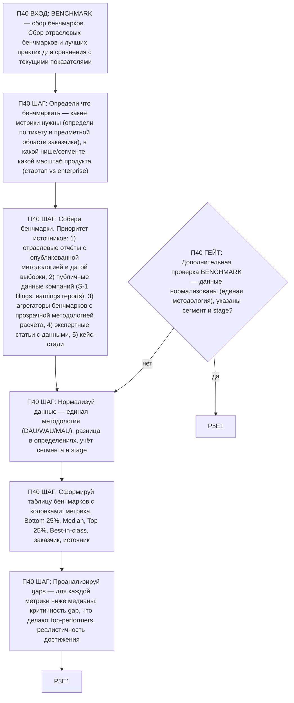

# Воркфлоу: BENCHMARK — Сбор бенчмарков

Фрагмент графа исследователя, этап П40. Вход — из П0 по ветке BENCHMARK; после последнего шага —
базовое завершение ядра (П3), затем дополнительная проверка ветки (П40G1) и self-check ядра (П5).

