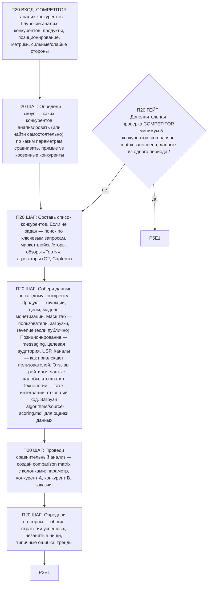

# Воркфлоу: COMPETITOR — Анализ конкурентов

Фрагмент графа исследователя, этап П20. Вход — из П0 по ветке COMPETITOR; после последнего шага —
базовое завершение ядра (П3), затем дополнительная проверка ветки (П20G1) и self-check ядра (П5).

