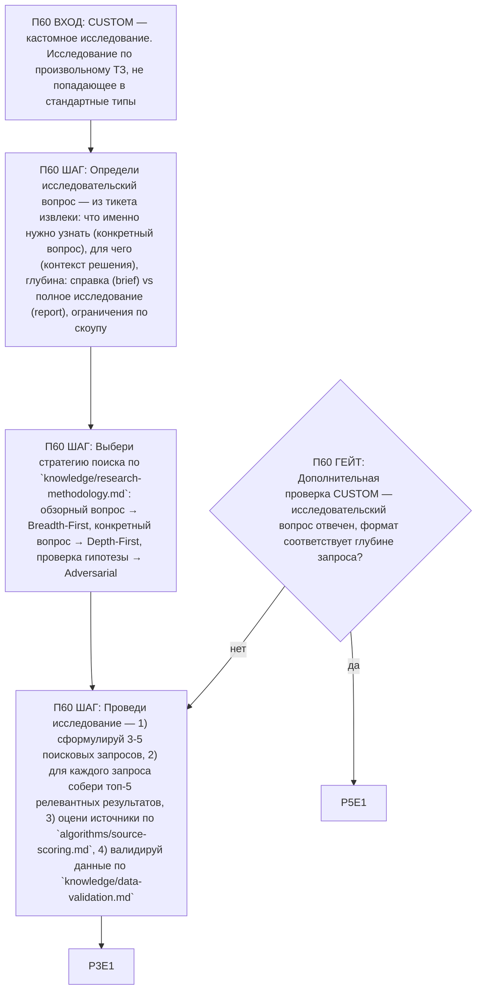

# Воркфлоу: CUSTOM — Кастомное исследование

Фрагмент графа исследователя, этап П60. Вход — из П0 по ветке CUSTOM (и по умолчанию, если тип
не определяется); после последнего шага — базовое завершение ядра (П3), затем дополнительная
проверка ветки (П60G1) и self-check ядра (П5).

