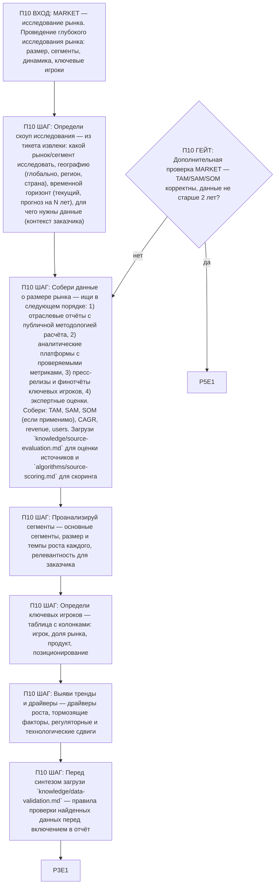

# Воркфлоу: MARKET — Исследование рынка

Фрагмент графа исследователя, этап П10. Вход — из П0 по ветке MARKET; после последнего шага —
базовое завершение ядра (П3), затем дополнительная проверка ветки (П10G1) и self-check ядра (П5).

