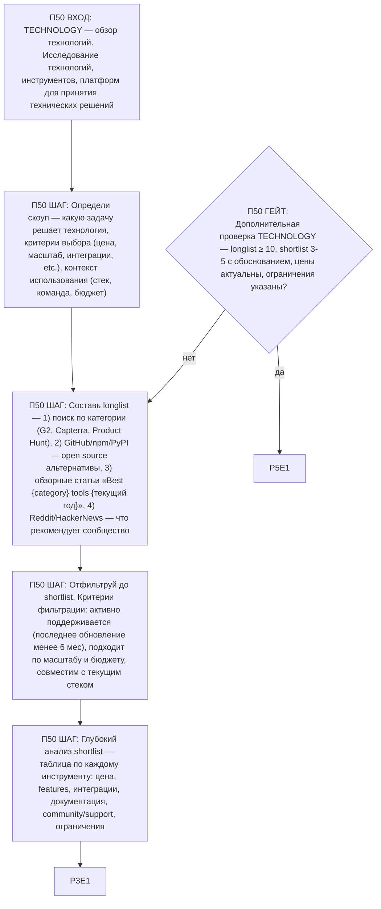

# Воркфлоу: TECHNOLOGY — Обзор технологий

Фрагмент графа исследователя, этап П50. Вход — из П0 по ветке TECHNOLOGY; после последнего шага —
базовое завершение ядра (П3), затем дополнительная проверка ветки (П50G1) и self-check ядра (П5).

