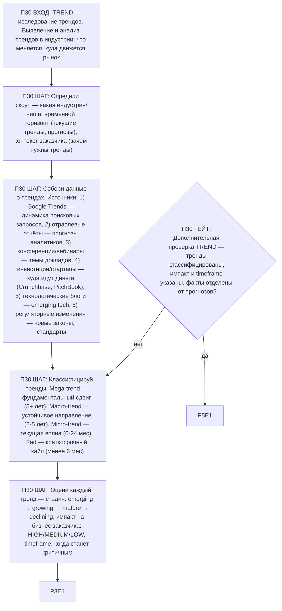

# Воркфлоу: TREND — Исследование трендов

Фрагмент графа исследователя, этап П30. Вход — из П0 по ветке TREND; после последнего шага —
базовое завершение ядра (П3), затем дополнительная проверка ветки (П30G1) и self-check ядра (П5).

