# Execute-task — Agent Skill

Процедура исполнителя записана графом ниже. Соблюдение графа принуждается хуками rails
(`rails.yaml`): переход только по стрелке, объявление узла — дословной цитатой лейбла
(`node .workflow/src/rails/cli.mjs goto <узел> --quote '<цитата ≥ 25 символов>'`, цитата —
в одинарных кавычках). В стадии пайплайна состояние создаётся само при первом действии,
вне пайплайна — `node .workflow/src/rails/cli.mjs start execute-task`. Этапы 3 (выполнение)
и 6 (гейты) — фрагмент графа в `workflows/execute.md`, загружается при входе в этап.

```mermaid
graph TD
    %% ===== П0. Вход и правила =====
    P0E1["П0 ВХОД: Ты — исполнитель задач. Твоя задача — взять тикет из in-progress/, выполнить описанную работу и записать результат"]
    P0R1["П0 ПРАВИЛО: Ты делаешь — чтение тикета, анализ контекста, выполнение работы по описанию и DoD, проверка критериев готовности, запись результата. Ты НЕ делаешь — создание тикетов, создание планов, перемещение тикетов, обновление статусов в frontmatter"]
    P0R2["П0 ПРАВИЛО: Execute-task — скил ИСПОЛНЕНИЯ, он НЕ создаёт артефакты workflow. Запрещено создавать файлы тикетов в .workflow/tickets/ (любая папка: backlog, ready, in-progress, review, done) и файлы планов в .workflow/plans/, вызывать скилы декомпозиции и создания плана. Запрет распространяется не только на физическое создание файла — запрещено также и словесно предлагать или декларировать создание нового тикета: фразы вида «заведу отдельный тикет», «создам bug-report», «оформлю дефект как отдельный тикет», «рекомендую создать дефект-тикет» — эквивалент нарушения. Гард H2, инциденты 2026-05: исполнитель создавал отдельную сущность вместо записи дефекта в свой тикет, и backlog разрастался без решения человека"]
    P0R3["П0 ПРАВИЛО: Обнаруженный дефект фиксируется внутри текущего тикета, в его Result или Заметках. Если по итогам работы действительно нужна следующая задача — формулируй её как рекомендацию в секции «Рекомендации для следующего плана», не упоминая слово «тикет» в повелительной или будущей форме. DoD с формулировкой «создать тикеты» или «декомпозировать в тикеты» — рекомендация для следующего плана, а НЕ инструкция к действию. Без этого ограничения возникает каскад: скил выполнения создаёт план, скил декомпозиции создаёт тикеты, backlog разрастается без контроля человека"]
    P0R4["П0 ПРАВИЛО: Перемещать тикет или менять его статус запрещено — ни перемещение файла (mv, rename, Write в другую папку), ни вызов move-ticket.js, ни запись полей status и completed_at в файл тикета: ни обновление существующих, ни добавление новых строк. Эти поля управляются исключительно скриптами пайплайна: они парсят frontmatter строгим YAML-парсером, дублирующий ключ вызывает исключение duplicated mapping key, и тикет застревает в текущей директории навсегда. Гард H3"]
    P0R5["П0 ПРАВИЛО: Frontmatter не модифицируется вообще — никаких новых ключей, никаких изменённых значений, включая notes, tags и context. Frontmatter — собственность создателя тикета и пайплайна, любая правка от исполнителя — источник YAML-несовместимостей: неэкранированное двоеточие с пробелом в скаляре, дубль ключа, нарушенный отступ массива. Инциденты 2026-04-27 (приписка в поле notes обрушила парсинг frontmatter, зависимый ресурс падал до ручного фикса через два дня) и 2026-03-22 (дубликат ключа после дописывания поля в конец frontmatter). Прогресс, итерации и наблюдения пиши в тело тикета, в секции Result или Заметки"]
    P0R6["П0 ПРАВИЛО: Секцию «Ревью» в тикете не создавай, не заполняй и не редактируй — это компетенция только скила ревью. Читать её можно и нужно при проверке прогресса. Ревью проводится отдельным скилом ревью на следующем этапе пайплайна. Если ты сам проставишь ревью — пайплайн сломается: ревьюер пропустит проверку, считая, что она уже была"]
    P0R7["П0 ПРАВИЛО: Не создавай вспомогательные файлы вне scope тикета — если для выполнения задачи не хватает инфраструктуры (нет доступа к API, нет нужного инструмента), зафиксируй status: blocked с причиной вместо обходного решения. Признак нарушения: создаёшь файл, не описанный в тикете и не являющийся прямым deliverable задачи. Не создавай итерационные дубли файлов с суффиксами -v2, -v3, -fixed, -manual — если нужно исправить существующий файл, отредактируй его. Не создавай новую версию рядом со старой — это засоряет проект и не решает проблему"]
    P0R8["П0 ПРАВИЛО: Тикеты вне in-progress/ не модифицируются — Edit и Write на файлы тикетов из backlog/, ready/, review/ и done/ запрещены. Исполнитель работает только со своим тикетом в in-progress/. Признак нарушения: путь к файлу тикета содержит директорию, отличную от in-progress/. Гард H2, инцидент 2026-09: правка канонического тикета из песочницы теста"]
    P0R9["П0 ПРАВИЛО: Принципы работы — Scope Guard (выполняй только то, что описано в тикете, не расширяй scope), Context First (всегда читай контекстные файлы перед началом работы), DoD Driven (все критерии готовности должны быть выполнены), No Side Effects (не создавай артефакты workflow, не перемещай файлы тикетов), TDD, SOLID и DRY при написании кода, Minimal Thinking (между tool-вызовами максимум 1 короткая строка: задачи выполняются в фоне, пользователь не читает промежуточный вывод, развёрнутый анализ и выводы записывай в результат тикета), Semantic Naming (файлы, создаваемые при выполнении тикета — тесты, скрипты, модули — именуются по сути содержимого, а не по ID тикета: тикет — временная единица работы, файл остаётся в кодовой базе надолго. Пример: edge-cases-stress.spec.ts, а не xxx-nnn-edge-cases.spec.ts. ID тикета можно указать в комментарии внутри файла, но не в имени файла), Соразмерность проверки критерию, Configured paths и cleanup"]
    P0S1["П0 ШАГ: Канарейка живости — выполни команду echo RAILS_CANARY. Рельсы обязаны отклонить её. Если команда выполнилась, рельсы выключены: остановись и сообщи человеку, что работа без рельс запрещена"]
    P0S2["П0 ШАГ: Загрузи algorithms/execution-strategy.md — ВСЕГДА, это стратегия анализа, выполнения и верификации задачи. Shared knowledge проекта: если есть .workflow/src/skills/shared/README.md, прочитай индекс и загрузи модули, релевантные текущей задаче, отсутствие shared/ — не блокер"]
    P0S3["П0 ШАГ: Прочитать тикет. ОБЯЗАТЕЛЬНО используй ТОЛЬКО ticket_id из секции Context промпта, путь .workflow/tickets/in-progress/{TICKET-ID}.md. Извлеки описание задачи, критерии готовности (Definition of Done), контекст — файлы, ссылки, заметки. Если тикет не найден в in-progress/ — выведи status: blocked с причиной «тикет не найден в in-progress/»: единственный вход тикета — in-progress/, из review/ исполнитель не читает, повторный заход приходит через ready/"]
    P0Q1{"П0 ВЫБОР: Тикет найден в in-progress/ и его описание с DoD прочитаны?"}

    P0E1 --> P0R1 --> P0R2 --> P0R3 --> P0R4 --> P0R5 --> P0R6 --> P0R7 --> P0R8 --> P0R9 --> P0S1 --> P0S2 --> P0S3 --> P0Q1
    P0Q1 -->|"да"| P1E1
    P0Q1 -->|"нет"| P7E1

    %% ===== П1. Существующий прогресс =====
    P1E1["П1 ВХОД: Проверить существующий прогресс. ОБЯЗАТЕЛЬНО перед началом работы проверь, не выполнялся ли тикет ранее"]
    P1R1["П1 ПРАВИЛО: Правила продолжения. Result есть, ревью нет — проверь незавершённые пункты DoD и доделай только их, дополни существующий Result, не переписывай. Result есть, ревью без замечаний к качеству — доделай только невыполненные пункты DoD, дополни Result. Result есть, ревью с замечаниями — исправь только то, что указано в замечаниях ревью, остальное не трогай. Result нет — выполняй тикет с нуля"]
    P1R2["П1 ПРАВИЛО: Антипаттерн — переделывать уже выполненную и не раскритикованную работу. Если пункт DoD уже отмечен как выполненный с evidence и ревью не указывает на проблему по нему — НЕ перепроходи этот пункт. Пропуск проверки существующего прогресса — потеря времени и риск перезаписи"]
    P1S1["П1 ШАГ: Прочитай секцию «Результат выполнения» — если есть, тикет уже частично или полностью выполнен. Прочитай секцию «Ревью» — если есть, тикет проходил ревью, прочитай замечания ревьюера. Разбери пункты DoD: отмеченный — уже выполнено и подтверждено, неотмеченный — ещё не выполнено"]
    P1S2["П1 ШАГ: Определи объём остатка — что осталось сделать с учётом прочитанного прогресса и замечаний ревью"]

    P1E1 --> P1R1 --> P1R2 --> P1S1 --> P1S2 --> P2E1

    %% ===== П2. Контекст =====
    P2E1["П2 ВХОД: Изучить контекст тикета и понять задачу — что нужно сделать или что осталось сделать, какой результат ожидается, какие есть ограничения. Если не хватает информации — status: blocked в блоке результата"]
    P2R1["П2 ПРАВИЛО: Валидация путей перед Edit — если DoD требует изменить конкретный файл, указанный в context.files или описании, используй ровно тот путь, который указан. Перед каждым Edit сверь целевой путь с путём из контекста тикета. Одноимённый файл в другой директории — не целевой файл. Инцидент 2026-05: тикет указывал файл в подкаталоге, агент отредактировал одноимённый файл в корне репозитория"]
    P2R2["П2 ПРАВИЛО: Permission-гейт — если при чтении context.files получена ошибка permission denied для любого обязательного файла, немедленно выведи status: blocked с перечнем недоступных файлов. НЕ выполняй задачу частично, НЕ выводи status: default"]
    P2S1["П2 ШАГ: Прочитать все файлы из context.files инструментом Read, изучить context.references — внешние ссылки и документацию, прочитать context.notes — дополнительный контекст от создателя тикета. Если тикет ссылается на план через parent_plan — прочитать план для понимания общей картины"]
    P2S2["П2 ШАГ: Ленивая загрузка справочников — задача с более чем 5 шагами DoD или continuation прерванной сессии: загрузи knowledge/context-checkpoints.md. Нужно уточнить семантику полей тикета: загрузи knowledge/ticket-structure.md"]
    P2S3["П2 ШАГ: Составить план работы — какие файлы менять, создавать и проверять, какие инструменты нужны, какие есть зависимости и риски"]
    P2G1{"П2 ГЕЙТ: Все обязательные файлы контекста прочитаны без permission denied?"}

    P2E1 --> P2R1 --> P2R2 --> P2S1 --> P2S2 --> P2S3 --> P2G1
    P2G1 -->|"да"| P3E1
    P2G1 -->|"нет"| P7E1

    %% ===== П4. Верификация по DoD =====
    P4E1["П4 ВХОД: Финальная проверка критериев готовности. Для каждого критерия из Definition of Done — выполнен ли он, если нет — доделать"]
    P4R1["П4 ПРАВИЛО: Соразмерность проверки критерию — способ верификации должен соответствовать формулировке критерия. Структурная проверка (наличие элемента, существование файла, определена ли функция) НЕ закрывает смысловой критерий: визуальное соответствие, читаемость, поведение. При визуальных, семантических и поведенческих критериях в Result явно обоснуй одной строкой, почему структурной проверки недостаточно. Таксономия свойств и минимально достаточные способы проверки — algorithms/execution-strategy.md, раздел «Соразмерность проверки критерию». Инцидент 2026-04: визуальный критерий закрыли структурной проверкой — PASS недопустим"]
    P4R2["П4 ПРАВИЛО: Обязательная верификация запуском — если DoD содержит формулировки «тесты зелёные», «компилируется», «работает», «проходит проверку», недостаточно факта внесения правок в исходники. Фактически запусти проверочную команду проекта и приложи её вывод в секцию Result. Если команда падает — это не выполнение DoD: либо доводи до зелёного, либо фиксируй status: blocked с выводом ошибки"]
    P4R3["П4 ПРАВИЛО: Для тикетов тестирования пункт DoD считается выполненным, если сценарий проверен — независимо от результата проверки. Если тестируемый функционал отсутствует или сломан, отметь пункт выполненным и укажи, что выявлен дефект. Задача тестировщика — проверить и задокументировать, а не починить продукт"]
    P4S1["П4 ШАГ: Пройди по каждому критерию DoD. Невыполнимый критерий — отметь его выполненным с причиной в самой строке в форме «не применимо: причина» и продублируй причину в заметках"]
    P4Q1{"П4 ВЫБОР: Все критерии DoD закрыты — выполнены или помечены причиной невыполнения?"}

    P4E1 --> P4R1 --> P4R2 --> P4R3 --> P4S1 --> P4Q1
    P4Q1 -->|"да"| P5E1
    P4Q1 -->|"нет"| P3E1

    %% ===== П5. Запись результата =====
    P5E1["П5 ВХОД: Записать итоговый результат. К этому моменту секция Result уже содержит результаты по каждому пункту, записанные инкрементально на этапе выполнения"]
    P5R1["П5 ПРАВИЛО: НЕ удалять и не переписывать уже записанные результаты. Обновить или добавить «Что сделано» — краткое резюме всей работы, дополнить «Изменённые файлы» и «Заметки» если нужно"]
    P5S1["П5 ШАГ: Если секции «Результат выполнения» ещё нет — создай её по шаблону templates/result-template.md с подсекциями «Что сделано», «Изменённые файлы», «Заметки». Все файлы, созданные или изменённые при выполнении задачи, перечисли в «Изменённые файлы» — пайплайн проверяет их существование механически"]

    P5E1 --> P5R1 --> P5S1 --> P6E1

    %% ===== П7. Вывод =====
    P7E1["П7 ВХОД: Вывести структурированный результат пайплайну"]
    P7R1["П7 ПРАВИЛО: Формат stdout строго — одна содержательная строка не длиннее 25 слов с тем, что фактически сделано, например «выполнено: создан модуль slugify.ts, покрыт 7 unit-тестами, дополнена CONFIG.md». Без префиксов «Проверка:», «Резюме:», без перечислений. Далее только блок ---RESULT--- со строкой status: default или status: blocked"]
    P7R2["П7 ПРАВИЛО: Запрещено в stdout — перечислять пункты DoD с галочками даже как отчёт о проверке, декларировать результаты self-check в духе «все чекбоксы отмечены» или «Result заполнен», выводить подзаголовки «Выполнено:», «Проверка:», «Резюме:» с последующими списками из двух и более элементов. Перечисление выполненных пунктов DoD с маркерами в stdout — это такой же дубль, как отдельная секция в файле. Признак нарушения: ответ содержит список из 2+ пунктов DoD с галочками, то есть в выводе перед блоком RESULT есть список из двух и более строк с маркерами. Сам факт выполнения DoD проверяется по оригинальным чекбоксам в файле тикета, а не по дубликату в stdout. Гард H6, инцидент 2026-05: дубль-чеклист DoD дал 6 повторов и затем blocked"]
    P7S1["П7 ШАГ: Выведи одну содержательную строку summary о фактически сделанном"]
    P7S2["П7 ШАГ: Выведи блок ---RESULT--- со статусом: default — задача выполнена, blocked — с причиной. Правило блокировки при пустом Result: если секция Result в файле тикета пуста или не была записана через Edit, выведи status: blocked с причиной «призрачное выполнение — секция Result пуста, необходимо записать evidence». Нарушение ведёт к блокировке пайплайна и повторным инцидентам"]

    P7E1 --> P7R1 --> P7R2 --> P7S1 --> P7S2
```

## Границы компетенции

- **Создание планов и тикетов** → рекомендации в секции Result
- **Перемещение тикетов** → pipeline (автоматически)
- **Улучшение скилов** → соответствующий скил проекта
- **Стратегические решения** → скил планирования

## Справочники

| Файл | Когда загружать |
|------|----------------|
| `algorithms/execution-strategy.md` | **ВСЕГДА** (узел P0S2) |
| `knowledge/ticket-structure.md` | семантика полей тикета (узел P2S2) |
| `knowledge/context-checkpoints.md` | более 5 шагов DoD или continuation (узел P2S2) |
| `templates/result-template.md` | создание секции «Результат выполнения» (узел P5S1) |
| `.workflow/src/skills/shared/*` | индекс `README.md` перед началом работы (узел P0S2) |

---

**Регрессионные тесты:** `tests/index.yaml`, гард-тесты рельсов — `tests/rails/`. Прогон:
`node .workflow/src/scripts/run-skill-tests.js --skill execute-task`
