# Воркфлоу: выполнение и гейты

Фрагмент графа execute-task: этап 3 (выполнение) и этап 6 (гейты перед выводом). Вход — из
этапа 2 (контекст прочитан) и из этапа 4 (критерий не закрыт); выход — в этап 4 (верификация)
и в этап 7 (вывод). Подход определяется содержимым тикета — описанием и DoD, а не его типом.
Алгоритм выбора подхода и чеклист выполнения — `algorithms/execution-strategy.md`.

```mermaid
graph TD
    %% ===== П3. Выполнение =====
    P3E1["П3 ВХОД: Выполнить работу и фиксировать результат инкрементально. Действовать по описанию и DoD тикета"]
    P3R1["П3 ПРАВИЛО: Подход определяется содержимым тикета, а не типом. Тикет требует изменения кода — следовать методологиям TDD, SOLID, DRY и запустить тесты после изменений. Требует изменения файлов — обязательный цикл Read, затем Edit или Write, затем Verify перечитыванием. Требует тестирования — выполнить чеклист проверок из DoD и зафиксировать pass или fail по каждому пункту. Требует исследования — использовать доступные инструменты для сбора данных и подкреплять источниками. Требует изменения документации — проверить актуальность, использовать единый стиль проекта. Требует взаимодействия с браузером — используй профиль или конфигурацию, которые проект определяет в .workflow/src/skills/shared/ (см. индекс README.md), если проект не определяет отдельный профиль — выбери настройки инструмента по задаче: headless для задач без авторизации, с сохранением сессии и данных — если задача требует уже аутентифицированного состояния, а после завершения работы обязательно освободи ресурсы, закрой сессию инструмента"]
    P3R2["П3 ПРАВИЛО: Инкрементальная запись обязательна. После выполнения каждого пункта сразу запиши результат в тикет: обнови чекбокс в оригинальной секции тикета, где он определён, и дополни описание результата в секции Result — что сделано, evidence. Это относится ко всем чеклистам тикета: основному чеклисту проверок, DoD и любым другим секциям с чекбоксами. Это защищает от потери прогресса при обрыве сессии — не откладывай запись на конец, записывай по ходу"]
    P3R3["П3 ПРАВИЛО: НЕ создавай дубль-чеклист в секции Result и НЕ дублируй чеклист в stdout-ответе. Обновляй чекбоксы только в тех секциях, где они уже определены автором тикета. В секции Result записывай развёрнутое описание, evidence и заметки, но не копируй туда чеклист с повторной разметкой. Пайплайн проверяет чекбоксы только в оригинальных секциях по заголовку — дубль-секция будет проигнорирована, и тикет застрянет в цикле retry, а затем blocked. Инцидент 2026-05: дубль-секция DoD-чеклиста дала 6 повторов и затем blocked"]
    P3R4["П3 ПРАВИЛО: Перед вставкой кода в существующий файл прочитай целевой участок и пойми его структуру. Определи границы функции, класса или блока, в который вставляешь код. Вставляй код в семантически правильное место, а не в произвольную точку файла. Если не уверен в месте вставки — прочитай окружающий контекст, строки до и после, и убедись, что вставка не разрывает существующую структуру"]
    P3R5["П3 ПРАВИЛО: Тесты на маппинг или парсинг данных — если тесты проверяют функцию, которая обрабатывает данные из runtime (логи, конфиги, ответы API, события UI), обязательно прочитай реальный источник данных и используй в fixtures реальные значения оттуда. Не выдумывай входные данные по предположению о формате. Проследи цепочку данных от источника до функции: какое поле приходит в какой параметр и с каким значением"]
    P3R6["П3 ПРАВИЛО: Configured paths и cleanup — файлы, создаваемые во время работы тикета, размещай в местах, явно указанных в конфиге соответствующего инструмента. Перед созданием файла, путь которого может зависеть от конфигурации (mock, тест, фикстура, стаб, snapshot, сгенерированный artifact, временный файл сборки), прочитай конфиг проекта, найди поле target-директории (roots, testDir, paths, output, outDir, srcDir или аналог) и помести файл туда. Создавать файл в корне репозитория без проверки конфига запрещено. После удаления временных или ошибочных файлов проверь и удали пустые родительские директории, созданные в ходе тикета. Каждая созданная директория — твоя ответственность вплоть до закрытия тикета: пустая папка или артефакт вне scope, оставленные в репозитории, — побочный эффект, то есть нарушение принципа No Side Effects. Антипаттерн: создал файл в корне (mock, snapshot, тест), инструмент не подхватил его из-за неправильного пути, файл удалил, а пустую папку оставил. Лечение: до создания — проверка конфига, после удаления — удаление пустых директорий. Инцидент 2026-05-01: мок лёг в корень репозитория вместо каталога из конфига тестов, тест упал, файл удалили, а пустые директории остались и сломали загрузку сборки"]
    P3R7["П3 ПРАВИЛО: Пункт DoD с проверкой visual — изображение результата кладётся ровно по пути из записи visual доступным тебе средством (снимок экрана, скриншот браузера, снимок интерфейса) и перечисляется в «Изменённых файлах». Изображение из другого источника вместо снимка результата запрещено: по нему модель ревью судит о результате, подмена снимка — подлог доказательства. Снять изображение не получается — пункт не отмечается выполненным, причина пишется в Result"]
    P3S1["П3 ШАГ: Изолируй scope — только файлы из DoD и context. Изменяй инкрементально, после каждого Edit или Write перечитай файл инструментом Read и убедись, что изменение корректно. Создание файла — Write, затем Read для проверки, затем проверить ссылки"]
    P3S2["П3 ШАГ: Если изменён код или тесты — фактически запусти проверочную команду проекта (build, test, lint, type-check) и приложи её вывод, последние строки с итоговым статусом, в секцию Result. Команду определи из конфигурации проекта, если она не указана явно. Порог переключения: если после 3 попыток подход не даёт прогресса — зафиксируй причину и status: blocked"]
    P3G1{"П3 ГЕЙТ: Каждый закрытый пункт DoD записан в файл тикета через Edit — чекбокс в оригинальной секции и evidence в Result?"}

    P3E1 --> P3R1 --> P3R2 --> P3R3 --> P3R4 --> P3R5 --> P3R6 --> P3R7 --> P3S1 --> P3S2 --> P3G1
    P3G1 -->|"да"| P4E1
    P3G1 -->|"нет"| P3S1

    %% ===== П6. Гейты перед выводом =====
    P6E1["П6 ВХОД: Финальная проверка перед завершением. Перед выводом блока RESULT выполни последовательно все три гейта. При любом нарушении вернись к этапу выполнения и исправь, не выводи RESULT"]
    P6S1["П6 ШАГ: GATE-1, проверка Edit-вызовов. За текущую сессию через инструмент Edit в файле тикета должны быть зафиксированы изменённые чекбоксы DoD, если на старте были невыполненные пункты, и непустая секция Result. Если ни одного вызова Edit на файл тикета не было — секция Result физически пустая, независимо от написанного в stdout. Это призрачное выполнение. Ключевой принцип: stdout не равен файлу тикета, результат существует только в том, что записано через инструмент Edit"]
    P6S2["П6 ШАГ: GATE-2, механическая Read-проверка. Выполни Read файла тикета и убедись. Ни одного неотмеченного чекбокса в секции критериев готовности — все переведены в отмеченные или помечены причиной невыполнения. Секция «Результат выполнения» физически заполнена — содержит реальный текст, а не скелет шаблона. Frontmatter не модифицирован вообще — никаких новых ключей, никаких изменённых значений"]
    P6S3["П6 ШАГ: GATE-3, self-check мысленно, не в stdout. Файл тикета перечитан после всех правок. Каждый пункт DoD отмечен, кроме пункта visual без снимка — у него причина в Result. Если изменён код или тесты — проверочная команда фактически запущена, её вывод приложен, итоговый статус зелёный или status: blocked с выводом ошибки. Секция Result не пустая и содержит summary, изменённые файлы, заметки. Каждый выполненный пункт DoD имеет соответствующий evidence. Все созданные файлы перечитаны после записи и перечислены в «Изменённые файлы». Все файлы из context.files были доступны без permission denied. Scope не расширен — изменены только файлы из DoD и context. Нет побочных эффектов — не созданы тикеты и планы, не перемещены файлы. Поля status и completed_at не записаны в файл тикета ни в каком виде. Секция «Ревью» не создавалась и не редактировалась тобой. Все временные и промежуточные файлы и пустые директории, не являющиеся deliverable, удалены"]
    P6G1{"П6 ГЕЙТ: Все три гейта пройдены — Edit-проверка, механическая Read-проверка, self-check?"}

    P6E1 --> P6S1 --> P6S2 --> P6S3 --> P6G1
    P6G1 -->|"да"| P7E1
    P6G1 -->|"нет"| P3E1
```

## Антипаттерны

- Создание тикетов или планов в `.workflow/` — запрещено (узел P0R2)
- Создание тикета при обнаружении дефекта — дефект фиксируется в Result текущего тикета (узел P0R3)
- Перемещение тикета, запись `status` и `completed_at` — запрещено (узел P0R4)
- Работа без чтения контекстных файлов — приводит к неполному решению (узел P2S1)
- Завершение задачи без реального изменения файлов, если тикет требует изменения (узел P6S1)
- Призрачное выполнение — вывод RESULT при пустой секции Result или неотмеченных DoD (узлы P6S1, P7S2)
- Редактирование файла не по пути из `context.files` (узел P2R1)
- Вставка кода без понимания структуры (узел P3R4)
- Пропуск проверки существующего прогресса (узел P1R2)
- Отложенная запись результата вместо инкрементальной (узел P3R2)

<!-- РАСШИРЕНИЕ: добавляй специфику ниже -->
