# Фрагмент графа: П40 — ACCEPTANCE

Проверка реализации по acceptance criteria из user story или требований. Цель
— подтвердить, что фича работает как задумано с точки зрения бизнеса. Вход из
узла P0Q1 ядра, выход — в self-check ядра (P5E1).

```mermaid
graph TD
    P40E1["П40 ВХОД: ACCEPTANCE — проверка реализации по acceptance criteria из user story или требований. Цель — подтвердить, что фича работает как задумано с точки зрения бизнеса. Общий порядок работы с тест-кейсом и фиксация дефекта — узлы ядра P0S5 и P0R7"]
    P40R1["П40 ПРАВИЛО: Для каждого acceptance criterion проверяются три случая: happy path — позитивный сценарий; негативный сценарий — что если данные невалидны; граничные значения — крайние допустимые значения. Ожидаемые UI-элементы каждого критерия берутся из source-of-truth (правила ядра P0R13 и P0R15), не из ожиданий агента"]
    P40S1["П40 ШАГ: Извлеки acceptance criteria. Из тикета или связанной user story извлеки: Acceptance Criteria (AC) — конкретные условия приёмки; Definition of Done (DoD) — общие критерии завершённости; контекст — зачем эта фича нужна, какую проблему решает; окружение — где тестировать (URL, стенд). Если AC не формализованы, извлеки их из описания и согласуй через комментарий к тикету"]
    P40S2["П40 ШАГ: Декомпозируй AC в тест-кейсы — для каждого acceptance criterion создай один или несколько тест-кейсов и веди таблицу «AC, тест-кейс, ожидаемый результат». Используй `knowledge/test-case-design.md` для полноты покрытия"]
    P40S3["П40 ШАГ: Выполни тест-кейсы. Для каждого: подготовь тестовые данные, выполни шаги — инструмент по узлу ядра P0S4 (desktop только через Sandbox ⛔, `knowledge/sandbox-core.md`), сравни результат с ожидаемым из AC, зафиксируй PASS / FAIL / BLOCKED / SKIPPED / OBSERVATION, при FAIL — a11y assertion плюс детальное описание расхождения"]
    P40S4["П40 ШАГ: Оцени покрытие AC — таблица «AC, статус, тест-кейсы, комментарий»: каждый критерий приёмки получает статус и ссылки на выполненные тест-кейсы, заблокированные критерии — причину блокировки"]
    P40S5["П40 ШАГ: Сформулируй вердикт. ACCEPTED — все AC пройдены, DoD выполнен. REJECTED — есть непройденные AC, указаны конкретные расхождения. PARTIALLY ACCEPTED — часть AC пройдена, остальные заблокированы. При REJECTED для каждого непройденного AC пройди узел ядра P0S5 и опиши расхождение между ожидаемым и фактическим"]
    P40S6["П40 ШАГ: Сформируй отчёт по шаблону `templates/test-session-report.md` — покрытие AC, статистика, вердикт, список дефектов"]
    P40G1{"П40 ГЕЙТ (чеклист валидации): все AC из тикета извлечены и покрыты тест-кейсами, для каждого AC есть happy path плюс негативный сценарий, все тест-кейсы выполнены, каждый FAIL привязан к конкретному AC, вердикт сформулирован (ACCEPTED / REJECTED / PARTIALLY), дефекты зафиксированы секциями DEFECT в QA-тикете для непройденных AC?"}

    P40E1 --> P40R1 --> P40S1 --> P40S2 --> P40S3 --> P40S4 --> P40S5 --> P40S6 --> P40G1
    P40G1 -->|"да"| P5E1
    P40G1 -->|"нет"| P40S3
```

