# Фрагмент графа: П30 — EXPLORATORY

Свободное исследование приложения для поиска неочевидных багов, UX-проблем и
аномалий, которые не покрыты формальными тест-кейсами. Вход из узла P0Q1
ядра, выход — в self-check ядра (P5E1).

```mermaid
graph TD
    P30E1["П30 ВХОД: EXPLORATORY — свободное исследование приложения для поиска неочевидных багов, UX-проблем и аномалий, которые не покрыты формальными тест-кейсами. Общий порядок работы и фиксация дефекта — узлы ядра P0S5 и P0R7"]
    P30R1["П30 ПРАВИЛО: Фиксируй всё — a11y tree assertions, наблюдения, подозрительное поведение. Записывай также «нормальное» поведение, которое кажется неочевидным: незаписанное наблюдение теряется вместе с сессией"]
    P30S1["П30 ШАГ: Определи charter (цель сессии). Из тикета извлеки или сформулируй сам: область исследования — какой модуль/страницу/фичу исследовать; фокус — что именно ищем (баги, UX-проблемы, edge cases, security); ограничение по времени — таймбокс сессии (рекомендуется 30-60 минут). Формат charter: «Исследовать [область] с целью обнаружить [тип проблем] используя [подход/технику]»"]
    P30S2["П30 ШАГ: Выбери технику исследования. Freestyle — первичное знакомство с фичей, общий обзор. Boundary Values — поля ввода, числовые параметры, лимиты. Error Guessing — основан на опыте, что обычно ломается. Negative Testing — невалидные данные, пустые поля, спецсимволы. State Transitions — проверка переходов между состояниями. Interruptions — прерывания: закрыть вкладку, потерять сеть, назад/вперёд. Cross-browser — проверка в разных браузерах и разрешениях. Загрузи `knowledge/test-case-design.md` для деталей по каждой технике"]
    P30S3["П30 ШАГ: Проведи сессию исследования. Открой целевую область — инструмент по узлу ядра P0S4 (desktop только через Sandbox ⛔, `knowledge/sandbox-core.md`). Следуй выбранной технике, но не ограничивай себя ей. При обнаружении бага немедленно зафиксируй: a11y tree assertion (текстовое подтверждение), точные шаги воспроизведения, URL и состояние; попробуй воспроизвести баг повторно для подтверждения"]
    P30S4["П30 ШАГ: Оформи находки. Для каждого найденного дефекта минимизируй шаги воспроизведения (правило ядра P0R10) и оформи по узлу ядра P0S5. Для наблюдений (не баги, но стоит обратить внимание) запиши отдельно: UX-неудобства, несоответствия в дизайне, медленные загрузки, непонятные формулировки"]
    P30S5["П30 ШАГ: Сформируй отчёт о сессии по шаблону `templates/test-session-report.md`. Включи: charter сессии, затраченное время, покрытые области (что успел проверить), непокрытые области (что осталось), список найденных багов с severity, наблюдения и рекомендации"]
    P30G1{"П30 ГЕЙТ (чеклист валидации): charter сформулирован до начала тестирования, каждый баг имеет evidence (a11y assertion плюс шаги воспроизведения), баги оформлены секциями DEFECT в QA-тикете, записаны наблюдения (даже если не баги), отчёт о сессии заполнен, указаны непокрытые области для будущих сессий?"}

    P30E1 --> P30R1 --> P30S1 --> P30S2 --> P30S3 --> P30S4 --> P30S5 --> P30G1
    P30G1 -->|"да"| P5E1
    P30G1 -->|"нет"| P30S3
```

