# Фрагмент графа: П20 — REGRESSION

Полная проверка существующей функциональности по набору тест-кейсов для
уверенности, что новые изменения не сломали ранее работавшее. Вход из узла
P0Q1 ядра, выход — в self-check ядра (P5E1).

```mermaid
graph TD
    P20E1["П20 ВХОД: REGRESSION — полная проверка существующей функциональности по набору тест-кейсов для уверенности, что новые изменения не сломали ранее работавшее. Общий порядок работы с тест-кейсом и фиксация дефекта — узлы ядра P0S5 и P0R7"]
    P20R1["П20 ПРАВИЛО: Группировка тест-кейсов по приоритету: P0 — критический путь (всегда выполняются), P1 — основные сценарии (выполняются при наличии времени), P2 — edge cases (выполняются при полной регрессии)"]
    P20S1["П20 ШАГ: Определи скоуп регрессии. Из тикета извлеки: что изменилось — какие фичи/модули затронуты; тест-сьют — если указан конкретный набор тест-кейсов, используй его; окружение — URL стенда, браузеры, устройства; дедлайн — если время ограничено, используй risk-based подход"]
    P20S2["П20 ШАГ: Сформируй набор тест-кейсов. Если тест-сьют не указан: определи затронутые модули по описанию изменений, подбери тест-кейсы, покрывающие эти модули, добавь тест-кейсы на смежную функциональность (интеграционные точки), приоритизируй по `algorithms/test-prioritization.md`"]
    P20S3["П20 ШАГ: Выполни тест-кейсы. Для каждого: прочитай предусловия и подготовь данные, выполни шаги — инструмент по узлу ядра P0S4 (desktop только через Sandbox ⛔, `knowledge/sandbox-core.md`), сравни фактический результат с ожидаемым, зафиксируй статус PASS / FAIL / BLOCKED / SKIPPED / OBSERVATION, при FAIL — a11y assertion плюс шаги воспроизведения плюс секция DEFECT в QA-тикете по формату `templates/bug-report.md`"]
    P20S4["П20 ШАГ: Отслеживай прогресс — веди таблицу с тест-кейсом, приоритетом, статусом и комментарием по каждой строке, чтобы прерванная сессия не потеряла уже проверенное"]
    P20S5["П20 ШАГ: Анализируй результаты после завершения всех тест-кейсов: подсчитай статистику (всего, pass, fail, blocked, skipped), определи блокирующие баги (CRITICAL/HIGH severity), сформулируй вердикт — REGRESSION PASSED — нет FAIL на P0/P1, нет CRITICAL/HIGH багов; REGRESSION FAILED — есть блокирующие дефекты; REGRESSION PASSED WITH ISSUES — есть MEDIUM/LOW баги, не блокируют релиз"]
    P20S6["П20 ШАГ: Сформируй отчёт по шаблону `templates/test-session-report.md` — окружение, таблица результатов, статистика, вердикт, список дефектов"]
    P20G1{"П20 ГЕЙТ (чеклист валидации): все P0 тест-кейсы выполнены, P1 выполнены или обосновано, почему пропущены, каждый FAIL имеет секцию DEFECT в тикете с severity, итоговая статистика подсчитана, вердикт сформулирован, отчёт заполнен?"}

    P20E1 --> P20R1 --> P20S1 --> P20S2 --> P20S3 --> P20S4 --> P20S5 --> P20S6 --> P20G1
    P20G1 -->|"да"| P5E1
    P20G1 -->|"нет"| P20S3
```

