# Фрагмент графа: П10 — SMOKE

Быстрая проверка критических сценариев после деплоя или сборки для
подтверждения базовой работоспособности. Вход из узла P0Q1 ядра, выход — в
self-check ядра (P5E1).

```mermaid
graph TD
    P10E1["П10 ВХОД: SMOKE — быстрая проверка критических сценариев после деплоя или сборки для подтверждения базовой работоспособности. Общий порядок работы с тест-кейсом и фиксация дефекта — узлы ядра P0S5 и P0R7"]
    P10R1["П10 ПРАВИЛО: Бюджет — из `context.notes`, либо дефолт 80 (`algorithms/mcp-budget.md`). Распредели его по тест-кейсам заранее (например, 80 вызовов / 8 TC = ~10 на TC). Если при выполнении расход превышает план — переключись на экономный режим: меньше промежуточных скриншотов, используй Snapshot (с a11y tree) вместо Screenshot и угадывания координат"]
    P10R2["П10 ПРАВИЛО: Реальные данные вместо тестовых заглушек (ОБЯЗАТЕЛЬНО) — если тикет требует smoke-тест конкретного функционала продукта (не инфраструктуры тестирования), используй реальную конфигурацию продукта, а не тестовые заглушки. Тестовый пайплайн/заглушка может маскировать дефекты, которые проявляются только с реальными данными (имена стадий, форматы полей, маппинги). Правило: если smoke-чеклист тикета описывает проверку конкретных runtime-значений (иконки, статусы, форматы label), запускай продукт с реальной конфигурацией. Stub-пайплайн допустим только для проверки инфраструктуры запуска (CI, деплой, connectivity)"]
    P10S1["П10 ШАГ: Определи предмет тестирования (ОБЯЗАТЕЛЬНО). Прежде чем начинать подготовку окружения — определи что именно ты тестируешь. UI приложения (визуальные элементы, горячие клавиши, меню) — тестируй через UI: запусти приложение, используй Click/Shortcut/Snapshot; НЕ запускай продукт из терминала — CLI и UI это разные code paths. CLI-инструмент → тестируй из терминала. API → тестируй через cURL/HTTP. Если проектный `shared` есть — загрузи релевантные модули по триггеру «карта UI-точек входа» (команды, горячие клавиши, views). Не изобретай способ запуска — используй задокументированные точки входа (из shared, либо, при отсутствии shared, из тикета/README проекта)"]
    P10S2["П10 ШАГ: Определи скоуп. Из тикета извлеки: URL окружения — какой стенд тестировать; что задеплоено — какие изменения вошли (PR, коммиты, фичи); критические сценарии — если указаны в тикете, используй их, иначе определи сам. Если критические сценарии не указаны, определи их по принципу: главная страница загружается, авторизация работает, ключевой бизнес-flow проходит (зависит от продукта), API отвечает корректно"]
    P10S3["П10 ШАГ: Подготовь чеклист из 5-15 проверок, у каждой сценарий, ожидаемый результат и статус. Загрузи `algorithms/test-prioritization.md` для приоритизации при ограниченном времени"]
    P10S4["П10 ШАГ: Выполни проверки. Инструмент — узел ядра P0S4 (desktop только через Sandbox ⛔, `knowledge/sandbox-core.md`). Для каждого сценария: открой целевое приложение (браузер или desktop), выполни действия (клики, ввод данных), проверь ожидаемый результат, запиши a11y tree assertion (текстовое подтверждение результата), запиши статус PASS / FAIL / BLOCKED / SKIPPED / OBSERVATION. Если элемент находится в списке, dropdown или скроллируемой области — прокрути в обоих направлениях (вверх И вниз), прежде чем делать вывод об отсутствии: dropdown может быть открыт в середине или в конце списка, элемент может находиться выше текущей видимой области. Не утверждай «элемента нет», если не просмотрел список полностью в обе стороны"]
    P10S5["П10 ШАГ: Budget Guard (ОБЯЗАТЕЛЬНО) — отслеживай расход бюджета (узел P10R1). Если потрачено более 50% бюджета и выполнено менее 50% TC — немедленно переключись в экономный режим (`algorithms/mcp-budget.md`, раздел «Экономный режим»): пометь текущий TC как OBSERVATION или BLOCKED и переходи к следующему. Не уходи в расследование причин (создание дополнительных тест-файлов, перебор форматов, многократный Refresh и так далее). Жёсткий порог: TC дороже 12 MCP-вызовов равно BLOCKED, без исключений — зафиксируй что наблюдалось и переходи к следующему TC. Rabbit hole detection: текущее действие не входит в шаги TC, или 3+ MCP-вызова на один и тот же элемент UI без изменения результата (повторный Snapshot/Refresh/Click) — СТОП. Расследование инфраструктуры, создание собственных инструментов, установка CLI при UI-тестировании — всё это rabbit holes, подробнее `algorithms/mcp-budget.md` раздел «Rabbit hole detection»"]
    P10S6["П10 ШАГ: Если DoD или тикет не совпадает с реальностью, но реальность корректна — исход OBSERVATION (не FAIL); в комментарии: «Реальность корректна, DoD/тикет содержит неточность. Рекомендация: обновить [что именно]». Не создавай баг-репорт — это не баг продукта"]
    P10S7["П10 ШАГ: Сформируй отчёт по шаблону `templates/test-session-report.md`. Обязательно включи: окружение (URL, браузер, дата/время), таблицу результатов по каждому сценарию, итоговый вердикт: SMOKE PASSED / SMOKE FAILED, список зафиксированных дефектов (если есть)"]
    P10G1{"П10 ГЕЙТ (чеклист валидации): все критические сценарии проверены, каждый FAIL имеет evidence (a11y assertion плюс шаги) и секцию DEFECT в тикете, отчёт заполнен с итоговым вердиктом?"}

    P10E1 --> P10R1 --> P10R2 --> P10S1 --> P10S2 --> P10S3 --> P10S4 --> P10S5 --> P10S6 --> P10S7 --> P10G1
    P10G1 -->|"да"| P5E1
    P10G1 -->|"нет"| P10S4
```

