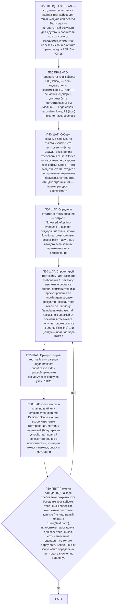

# Фрагмент графа: П50 — TEST-PLAN

Создание тест-плана и набора тест-кейсов для фичи, модуля или релиза. Вход из
узла P0Q1 ядра, выход — в self-check ядра (P5E1).

```mermaid
graph TD
    P50E1["П50 ВХОД: TEST-PLAN — создание тест-плана и набора тест-кейсов для фичи, модуля или релиза. Тест-план — авторитетный документ для другого исполнителя, поэтому список ожидаемых элементов берётся из source-of-truth (правила ядра P0R13 и P0R15)"]
    P50R1["П50 ПРАВИЛО: Приоритеты тест-кейсов: P0 (Critical) — если падает, релиз невозможен; P1 (High) — основные сценарии, должны быть протестированы; P2 (Medium) — edge cases и secondary flows; P3 (Low) — nice-to-have, cosmetic"]
    P50S1["П50 ШАГ: Собери входные данные. Из тикета извлеки: что тестируем — фича, модуль, эпик, релиз; требования / User Stories — на основе чего строить тест-кейсы; Scope — что входит и что НЕ входит в тестирование; окружение — браузеры, устройства, стенды; ограничения — время, ресурсы, зависимости"]
    P50S2["П50 ШАГ: Определи стратегию тестирования — загрузи `knowledge/testing-types.md` и выбери подходящие типы (smoke, functional, cross-browser, accessibility и другие), у каждого типа запиши применимость и обоснование"]
    P50S3["П50 ШАГ: Спроектируй тест-кейсы. Для каждого требования / user story: извлеки acceptance criteria, примени техники проектирования по `knowledge/test-case-design.md`, создай тест-кейсы по шаблону `templates/test-case.md`. Каждый ожидаемый UI-элемент в тест-кейсе получает рядом ссылку на source (`file:line` или цитату) — правило ядра P0R15"]
    P50S4["П50 ШАГ: Приоритизируй тест-кейсы — загрузи `algorithms/test-prioritization.md` и присвой приоритет каждому тест-кейсу по узлу P50R1"]
    P50S5["П50 ШАГ: Оформи тест-план по шаблону `templates/test-plan.md`. Включи: Scope и out-of-scope, стратегию тестирования, матрицу окружений (браузеры на устройства), полный список тест-кейсов с приоритетами, критерии входа и выхода, риски и митигации"]
    P50G1{"П50 ГЕЙТ (чеклист валидации): каждое требование покрыто хотя бы одним тест-кейсом, тест-кейсы содержат конкретные тестовые данные (не «валидный email», а `user@test.com`), приоритеты проставлены для всех тест-кейсов, есть негативные сценарии, не только happy path, Scope и out-of-scope чётко определены, тест-план заполнен по шаблону?"}

    P50E1 --> P50R1 --> P50S1 --> P50S2 --> P50S3 --> P50S4 --> P50S5 --> P50G1
    P50G1 -->|"да"| P5E1
    P50G1 -->|"нет"| P50S3
```
