# Воркфлоу: парсинг тикета и специальные проверки

Фрагмент графа review-result: этап 3 (парсинг тикета и проверка каждого пункта DoD) и этап 4
(сверка результата, проверка глазами целевой аудитории, верификация реальных изменений,
визуальная верификация скриншотов). Вход — из этапа 2 (механическая предпроверка пройдена) и
из этапа 5 (оснований для вердикта нет); выход — в этап 5 (правило QA-тикетов и вердикт).
Сюда попадают только тикеты с последней записью ревью `failed` или без секции `## Ревью`.

```mermaid
graph TD
    %% ===== П3. Парсинг тикета и проверка DoD =====
    P3E1["П3 ВХОД: Парсинг тикета и проверка каждого пункта DoD"]
    P3R1["П3 ПРАВИЛО: Извлеки из тикета обязательные поля — DoD из секции «Критерии готовности (Definition of Done)» как чеклист, детали задачи из секции «Детали задачи» как требования к реализации, результат из секции «Результат выполнения» как что сделано и изменённые файлы, тип задачи из frontmatter type. Необязательное поле — executor_type из frontmatter"]
    P3R2["П3 ПРАВИЛО: Тип проверки по формулировке критерия. Файл существует по указанному пути — Read или Glob по пути, если не найден, то fallback через ls указанного пути, потому что Glob не видит untracked-каталоги. Код компилируется или линтер проходит — запуск lint или build. Тесты проходят — запуск тестов. Текстовый критерий — поиск контента в файле. Структура соответствует шаблону — сравнение с эталоном"]
    P3R3["П3 ПРАВИЛО: Заявленный в DoD способ реализации теста ортогонален результату прогона. Формулировки уровня эталона (baseline, snapshot, inline-snapshot, побайтное или точное совпадение) требуют проверки способа реализации: точное сравнение с литералом-эталоном, а не регекс или includes. Зелёный прогон сам по себе такой критерий не закрывает. Инцидент 2026-04-24: DoD заявил inline-snapshot в коде теста, фактический тест использовал только сравнение по регексам, регрессия рефакторинга прошла мимо теста, а ревью приняло её со ссылкой на зелёный прогон"]
    P3R4["П3 ПРАВИЛО: Изоляция автотеста проверяется отдельно от результата прогона. Зелёный тест, который пишет в рабочий репозиторий и полагается на очистку в теле функции, — токсичный: при прерывании он оставляет артефакты в рабочем дереве и ложно срабатывают механические проверки. Красные и зелёные флаги изоляции — knowledge/test-hygiene.md. Инцидент 2026-04: тест писал в реальный конфиг проекта вместо временного каталога"]
    P3S1["П3 ШАГ: Для каждого критерия из DoD определи тип проверки и выполни её. Загрузи knowledge/dod-patterns.md для типичных паттернов DoD по категории задачи, knowledge/test-hygiene.md — если DoD требует создать или изменить автотест, knowledge/baseline-snapshot-validation.md — если в DoD есть формулировки baseline, snapshot или эталон"]
    P3S2["П3 ШАГ: Сверка результата с требованиями — сравни секцию «Результат выполнения» с «Деталями задачи»: все ли требования учтены, соответствует ли реализация описанию, нет ли расхождений между заявленным и реальным"]

    P3E1 --> P3R1 --> P3R2 --> P3R3 --> P3R4 --> P3S1 --> P3S2 --> P4E1

    %% ===== П4. Специальные проверки =====
    P4E1["П4 ВХОД: Специальные проверки — аудитория, реальные изменения, скриншоты"]
    P4R1["П4 ПРАВИЛО: Проверка с позиции целевой аудитории применяется, когда результат — документ, ТЗ или спецификация для конкретного исполнителя, и в DoD есть критерий вида «файл самодостаточен» или «исполнитель не должен смотреть другие документы». Провал по любому пункту — failed: credentials не указаны и не описано, где взять (признак — плейсхолдеры вида XXX, TODO, «заменить на реальный»), не перечислены все системные зависимости, условные параметры невычислимы, не описан механизм переключения окружений. Правило: прочитай документ глазами целевого исполнителя, и если он не может начать работу без дополнительных вопросов — failed"]
    P4R2["П4 ПРАВИЛО: Верификация реальных изменений применяется только для тикетов с executor_type не human, формализованный алгоритм — algorithms/verification.md. Провал по любому пункту — failed: файлы-артефакты из «Изменённых файлов» не существуют (проверка через Read или Glob, при ненайденном файле fallback через ls, потому что Glob не видит файлы в новых untracked-каталогах, и только если оба способа не нашли — failed), файл содержит шаблон или заглушку вместо реального контента, секция результата пуста, отметка в DoD не подтверждается открытым артефактом"]
    P4R3["П4 ПРАВИЛО: Визуальная верификация скриншотов применяется при любом из двух условий. Первое: в тикете (DoD, результаты TC, секция evidence, «Изменённые файлы») есть ссылки на файлы .png. Второе: тикет содержит TC или DoD с визуальными критериями — формулировки о том, как элемент выглядит пользователю: «оформлен как», «выглядит», «читаем», «контрастен», «виден», «выровнен», «не обрезан», «стилизован», «нет overflow», «визуально выделен», а также любые отрицания о внешнем виде («не голый», «не пустой», «без X»). Достаточно одного такого TC, чтобы проверка стала обязательной. Инцидент 2026-04: триггер расширен с явных ссылок на .png на визуальные критерии, потому что скриншоты исполнитель приложить не обязан"]
    P4S1["П4 ШАГ: При визуальном критерии без явных ссылок на .png сначала определи, существуют ли скриншоты вообще: Glob по типичным местам хранения артефактов проекта на файлы .png с фильтром по ID тикета или имени теста. Скриншоты найдены — переходи к основной проверке для каждого файла, сопоставимого с визуальным TC. Исполнитель мог сохранить скрины, но не сослаться на них в тикете, либо мог не сделать скрины вовсе. Скриншотов нет, а визуальные TC есть — это finding: evidence визуальных TC только текстовый, без визуального артефакта. Зафиксируй issue уровня HIGH: визуальное свойство не может быть подтверждено программной проверкой существования узла разметки, и ревьюер не может подтвердить визуальный критерий без визуального evidence"]
    P4S2["П4 ШАГ: Основная проверка каждого скриншота — открой файл через Read (модель мультимодальна, изображения читаются визуально), прочитай заявление TC, к которому привязан скриншот, и визуально проверь, подтверждает ли скриншот заявленное. Опиши своими словами, что видишь на скриншоте, прежде чем выносить вердикт: выносить вердикт без описания содержимого запрещено"]
    P4S3["П4 ШАГ: Вердикты по скриншоту — MATCH, если скриншот однозначно подтверждает заявление TC (в записи ревью указать «VV: что видно — MATCH»), PARTIAL, если скриншот релевантен, но элемент обрезан, нечитаем или не доказывает утверждение однозначно, MISMATCH, если скриншот не соответствует заявленному: другое содержимое, пустой экран, не тот экран. MISMATCH любого скриншота — failed с указанием файла, заявленного и фактически видимого. PARTIAL не блокирует, но фиксируется в issues. Issue про визуальный TC без скриншота — не автоматический failed, но фиксируется как issue уровня HIGH и включается в самари ревью"]
    P4G1{"П4 ГЕЙТ: Все применимые специальные проверки выполнены — аудитория, реальные изменения, скриншоты?"}

    P4E1 --> P4R1 --> P4R2 --> P4R3 --> P4S1 --> P4S2 --> P4S3 --> P4G1
    P4G1 -->|"да"| P5E1
    P4G1 -->|"нет"| P4S1
```

## Антипаттерны

- Одобрить тикет с невалидным frontmatter, прочитав содержимое глазами (узел P1R1)
- Принять таблицу PASS и FAIL в тексте результата вместо отметок в DoD (узел P2R1)
- Принять зелёный прогон как доказательство snapshot-критерия (узел P3R3)
- Вынести passed по UI-именам без сверки с source-of-truth (узел P0R5)
- Принять парный handoff-тикет как evidence передачи работы (узел P0R6)
- Вынести вердикт по скриншоту без описания его содержимого (узел P4S2)
- Исправить найденную ошибку самому вместо фиксации замечания (узел P0R4, принцип No Fix)

<!-- РАСШИРЕНИЕ: добавляй специфику ниже -->
