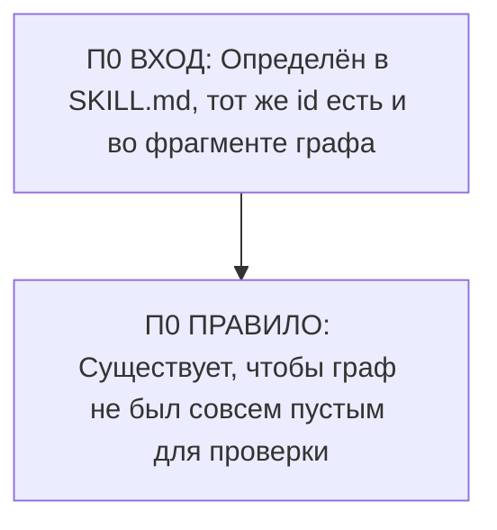

```mermaid
graph TD
    P0E1["П0 ВХОД: Определён в SKILL.md, тот же id есть и во фрагменте графа"]
    P0R1["П0 ПРАВИЛО: Существует, чтобы граф не был совсем пустым для проверки"]
    P0E1 --> P0R1
```
