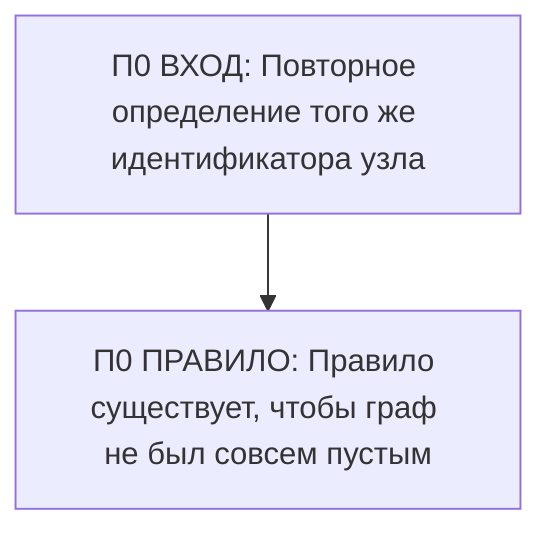

```mermaid
graph TD
    P0E1["П0 ВХОД: Начало работы над задачей для проверки dup-id"]
    P0E1["П0 ВХОД: Повторное определение того же идентификатора узла"]
    P0R1["П0 ПРАВИЛО: Правило существует, чтобы граф не был совсем пустым"]
    P0E1 --> P0R1
```
