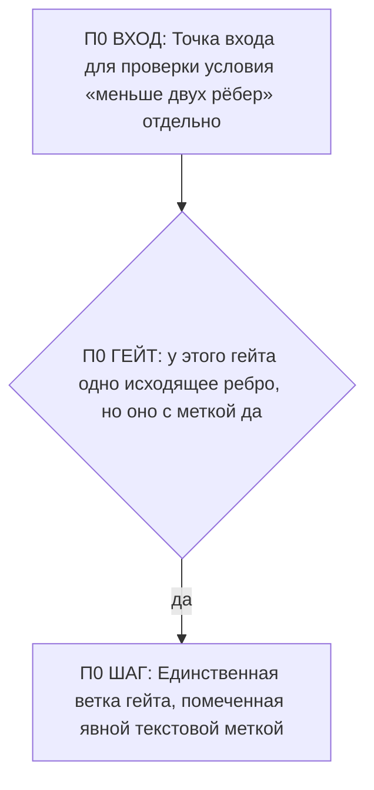

```mermaid
graph TD
    P0E1["П0 ВХОД: Точка входа для проверки условия «меньше двух рёбер» отдельно"]
    P0G1{"П0 ГЕЙТ: у этого гейта одно исходящее ребро, но оно с меткой да"}
    P0S1["П0 ШАГ: Единственная ветка гейта, помеченная явной текстовой меткой"]
    P0E1 --> P0G1
    P0G1 -->|"да"| P0S1
```
