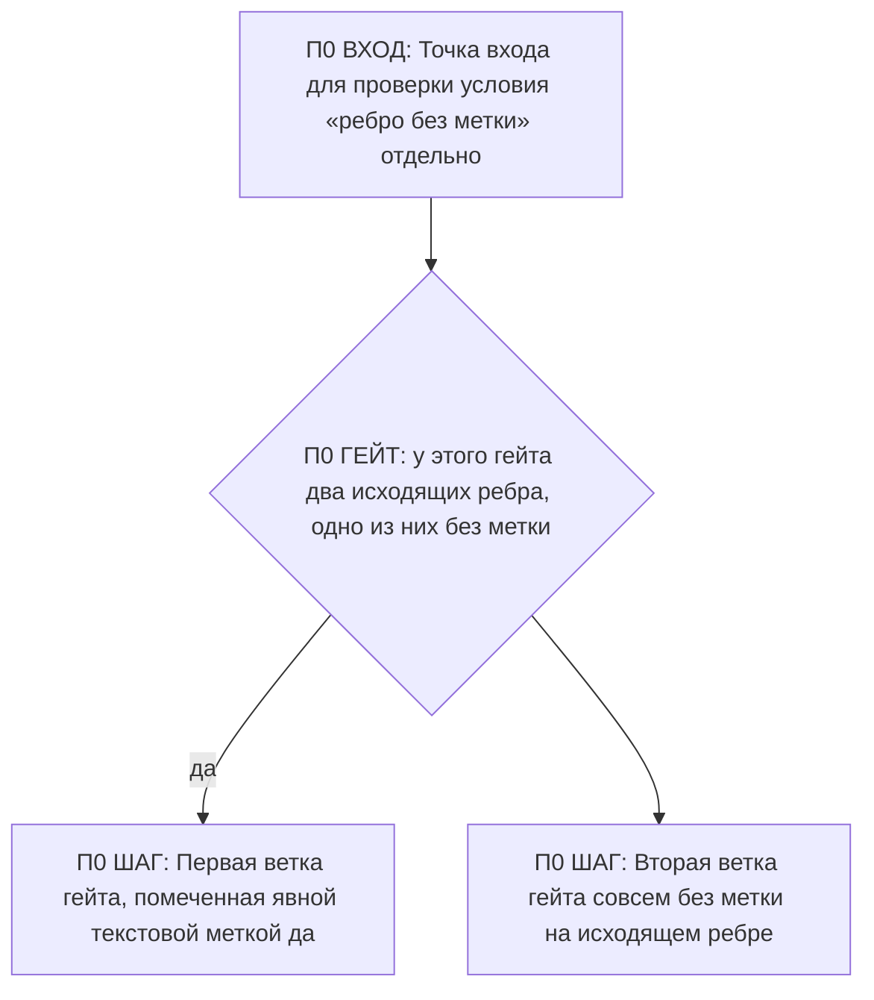

```mermaid
graph TD
    P0E1["П0 ВХОД: Точка входа для проверки условия «ребро без метки» отдельно"]
    P0G1{"П0 ГЕЙТ: у этого гейта два исходящих ребра, одно из них без метки"}
    P0S1["П0 ШАГ: Первая ветка гейта, помеченная явной текстовой меткой да"]
    P0S2["П0 ШАГ: Вторая ветка гейта совсем без метки на исходящем ребре"]
    P0E1 --> P0G1
    P0G1 -->|"да"| P0S1
    P0G1 --> P0S2
```
