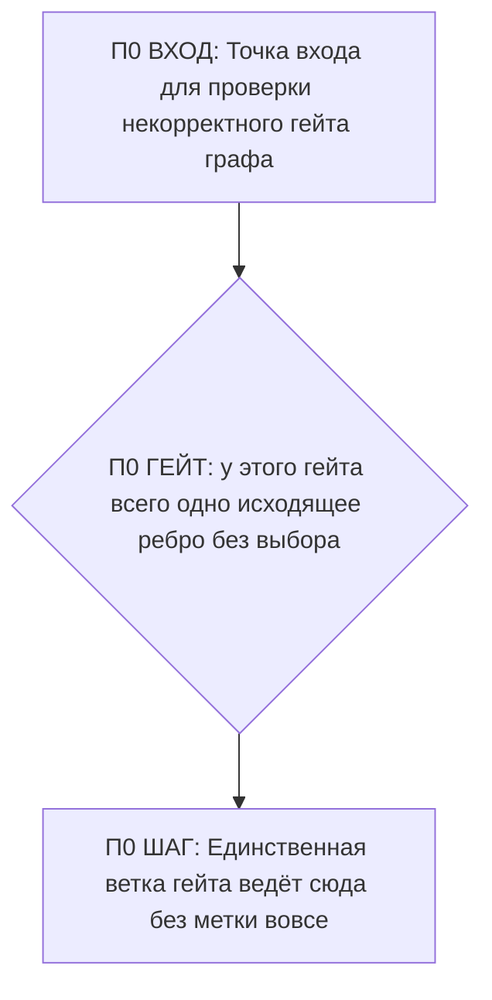

```mermaid
graph TD
    P0E1["П0 ВХОД: Точка входа для проверки некорректного гейта графа"]
    P0G1{"П0 ГЕЙТ: у этого гейта всего одно исходящее ребро без выбора"}
    P0S1["П0 ШАГ: Единственная ветка гейта ведёт сюда без метки вовсе"]
    P0E1 --> P0G1
    P0G1 --> P0S1
```
