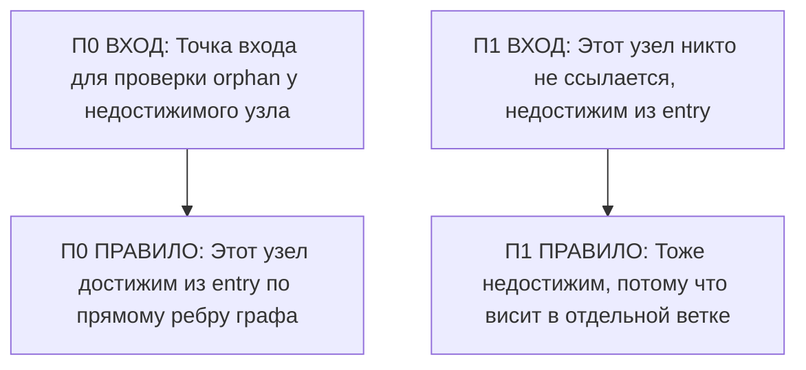

```mermaid
graph TD
    P0E1["П0 ВХОД: Точка входа для проверки orphan у недостижимого узла"]
    P0R1["П0 ПРАВИЛО: Этот узел достижим из entry по прямому ребру графа"]
    P0E1 --> P0R1

    P1E1["П1 ВХОД: Этот узел никто не ссылается, недостижим из entry"]
    P1R1["П1 ПРАВИЛО: Тоже недостижим, потому что висит в отдельной ветке"]
    P1E1 --> P1R1
```
