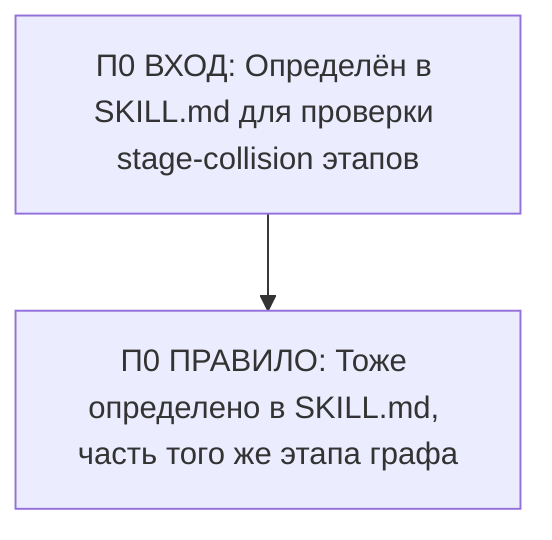

```mermaid
graph TD
    P0E1["П0 ВХОД: Определён в SKILL.md для проверки stage-collision этапов"]
    P0R1["П0 ПРАВИЛО: Тоже определено в SKILL.md, часть того же этапа графа"]
    P0E1 --> P0R1
```
