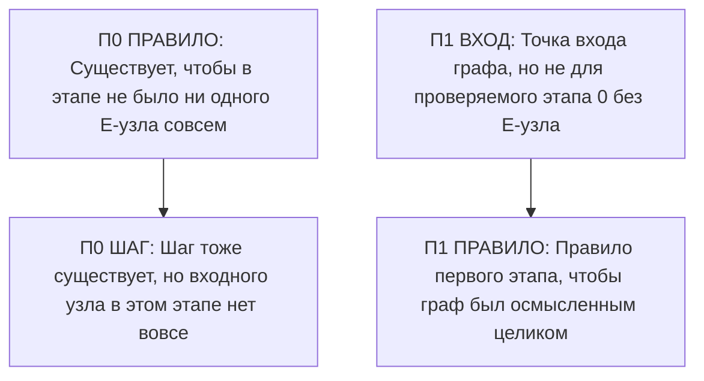

```mermaid
graph TD
    P0R1["П0 ПРАВИЛО: Существует, чтобы в этапе не было ни одного E-узла совсем"]
    P0S1["П0 ШАГ: Шаг тоже существует, но входного узла в этом этапе нет вовсе"]
    P0R1 --> P0S1

    P1E1["П1 ВХОД: Точка входа графа, но не для проверяемого этапа 0 без E-узла"]
    P1R1["П1 ПРАВИЛО: Правило первого этапа, чтобы граф был осмысленным целиком"]
    P1E1 --> P1R1
```
