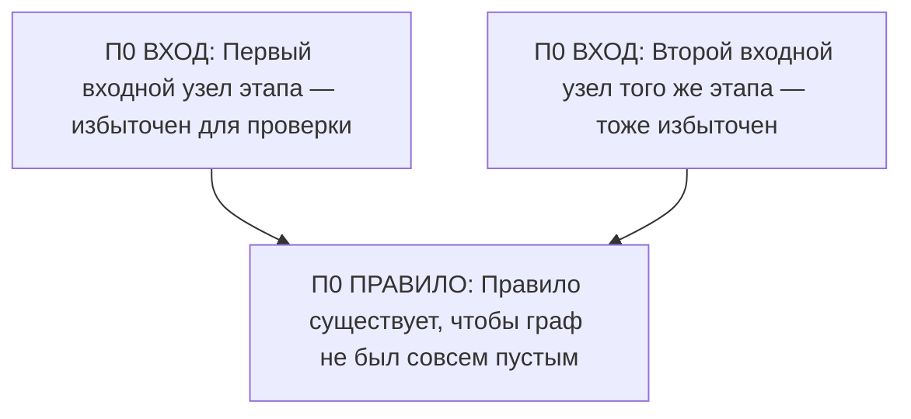

```mermaid
graph TD
    P0E1["П0 ВХОД: Первый входной узел этапа — избыточен для проверки"]
    P0E2["П0 ВХОД: Второй входной узел того же этапа — тоже избыточен"]
    P0R1["П0 ПРАВИЛО: Правило существует, чтобы граф не был совсем пустым"]
    P0E1 --> P0R1
    P0E2 --> P0R1
```
