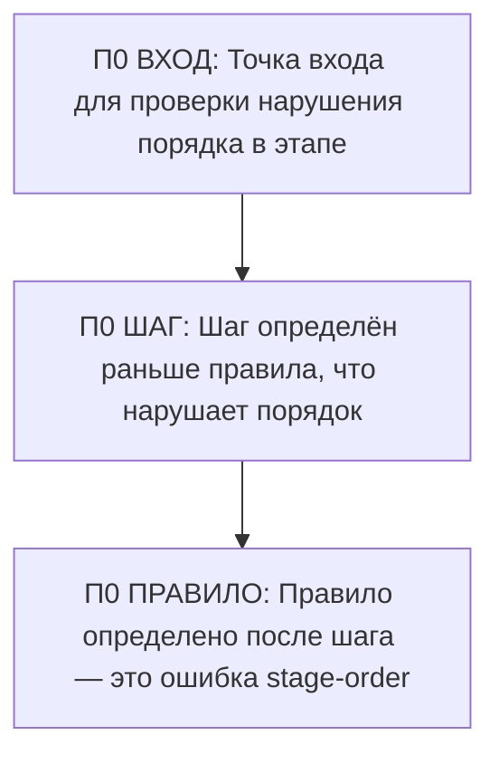

```mermaid
graph TD
    P0E1["П0 ВХОД: Точка входа для проверки нарушения порядка в этапе"]
    P0S1["П0 ШАГ: Шаг определён раньше правила, что нарушает порядок"]
    P0R1["П0 ПРАВИЛО: Правило определено после шага — это ошибка stage-order"]
    P0E1 --> P0S1
    P0S1 --> P0R1
```
