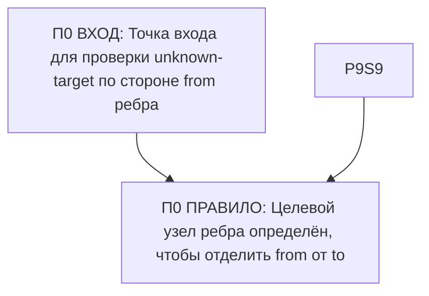

```mermaid
graph TD
    P0E1["П0 ВХОД: Точка входа для проверки unknown-target по стороне from ребра"]
    P0R1["П0 ПРАВИЛО: Целевой узел ребра определён, чтобы отделить from от to"]
    P0E1 --> P0R1
    P9S9 --> P0R1
```
