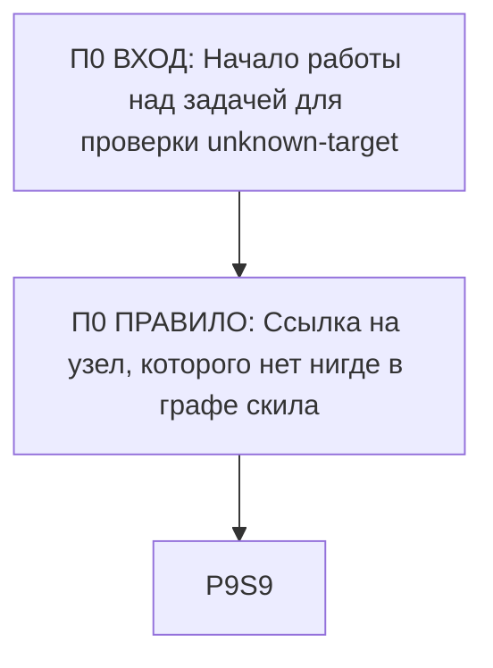

```mermaid
graph TD
    P0E1["П0 ВХОД: Начало работы над задачей для проверки unknown-target"]
    P0R1["П0 ПРАВИЛО: Ссылка на узел, которого нет нигде в графе скила"]
    P0E1 --> P0R1
    P0R1 --> P9S9
```
