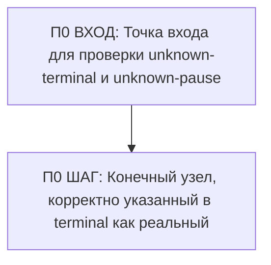

```mermaid
graph TD
    P0E1["П0 ВХОД: Точка входа для проверки unknown-terminal и unknown-pause"]
    P0S1["П0 ШАГ: Конечный узел, корректно указанный в terminal как реальный"]
    P0E1 --> P0S1
```
