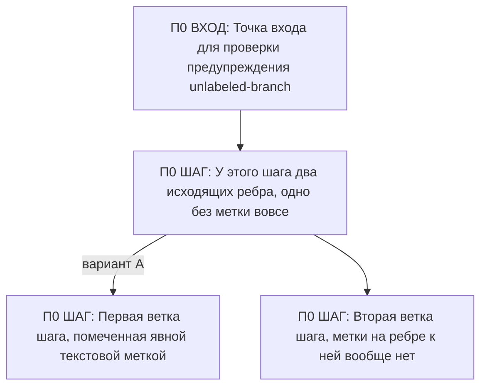

```mermaid
graph TD
    P0E1["П0 ВХОД: Точка входа для проверки предупреждения unlabeled-branch"]
    P0S1["П0 ШАГ: У этого шага два исходящих ребра, одно без метки вовсе"]
    P0S2["П0 ШАГ: Первая ветка шага, помеченная явной текстовой меткой"]
    P0S3["П0 ШАГ: Вторая ветка шага, метки на ребре к ней вообще нет"]
    P0E1 --> P0S1
    P0S1 -->|"вариант А"| P0S2
    P0S1 --> P0S3
```
