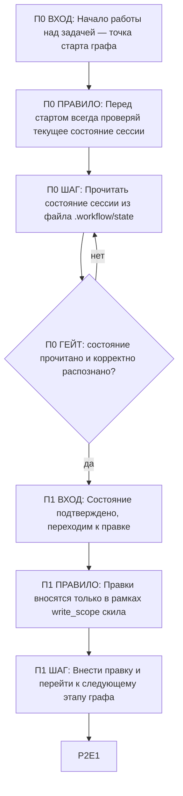

# Фикстура: валидный граф (skill=valid)

```mermaid
graph TD
    %% Этап 0
    P0E1["П0 ВХОД: Начало работы над задачей — точка старта графа"]
    P0R1["П0 ПРАВИЛО: Перед стартом всегда проверяй текущее состояние сессии"]
    P0S1["П0 ШАГ: Прочитать состояние сессии из файла .workflow/state"]
    P0G1{"П0 ГЕЙТ: состояние прочитано и корректно распознано?"}
    P0E1 --> P0R1
    P0R1 --> P0S1
    P0S1 --> P0G1
    P0G1 -->|"да"| P1E1
    P0G1 -->|"нет"| P0S1

    %% Этап 1
    P1E1["П1 ВХОД: Состояние подтверждено, переходим к правке"]
    P1R1["П1 ПРАВИЛО: Правки вносятся только в рамках write_scope скила"]
    P1S1["П1 ШАГ: Внести правку и перейти к следующему этапу графа"]
    P1E1 --> P1R1
    P1R1 --> P1S1
    P1S1 --> P2E1
```
