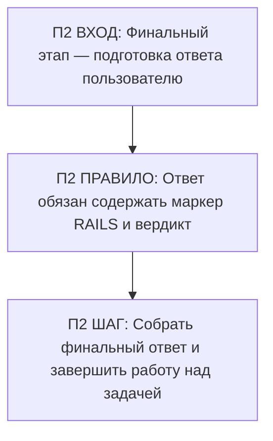

# Фикстура: фрагмент графа (этап 2), проверяет склейку с SKILL.md

```mermaid
graph TD
    %% Этап 2 — определён во фрагменте, а не в SKILL.md
    P2E1["П2 ВХОД: Финальный этап — подготовка ответа пользователю"]
    P2R1["П2 ПРАВИЛО: Ответ обязан содержать маркер RAILS и вердикт"]
    P2S1["П2 ШАГ: Собрать финальный ответ и завершить работу над задачей"]
    P2E1 --> P2R1
    P2R1 --> P2S1
```
